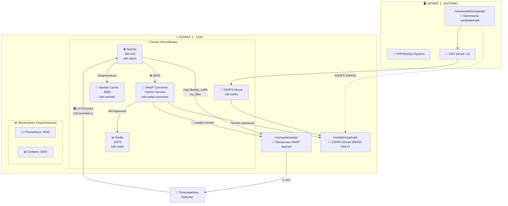

# 🚀 Битрикс CDN Сервер с автоматической WebP конвертацией

**Автор**: Chibilyaev Alexandr | **Company**: AAChibilyaev LTD | **Email**: info@aachibilyaev.com


## 📋 О проекте

**Высокопроизводительный CDN сервер** для Битрикс с автоматической конвертацией изображений в WebP формат. 

⚠️ **ВАЖНО**: Это решение для ДВУХ физически разных серверов:
- **Сервер 1**: Битрикс с оригинальными файлами в `/upload/`
- **Сервер 2**: CDN который через SSHFS читает оригиналы и создает WebP версии в локальном кеше

Снижает нагрузку на основной сервер на 95% и ускоряет загрузку изображений в 3 раза.

### ✨ Ключевые преимущества

- 🎯 **Экономия 40-55%** размера изображений
- ⚡ **Ускорение загрузки** страниц в 2-3 раза
- 🔄 **Автоматическая конвертация** в WebP на лету
- 📊 **Полный мониторинг** через Grafana
- 🛡️ **Отказоустойчивость** с auto-recovery
- 🐳 **Docker-ready** решение

## ⚡ Quick Start

```bash
# 1. Клонирование и настройка
git clone https://github.com/AAChibilyaev/bitrix-cdn.git
cd bitrix-cdn

# 2. Конфигурация окружения
cp .env.example .env
nano .env  # Настройте параметры вашего сервера

# 3. Генерация SSH ключей и запуск
./docker-manage.sh setup
docker-compose up -d

# 4. Добавьте публичный ключ на Битрикс сервер:
cat docker/ssh/bitrix_mount.pub
# >> Скопируйте в ~/.ssh/authorized_keys на сервере Битрикс

# 5. Запуск системы (выберите вариант):
docker-compose up -d                           # 🏭 Production (полный стек)
docker-compose -f docker-compose.dev.yml up -d # 🛠️ Development (упрощенный)  
docker-compose -f docker-compose.local.yml up -d # 🏠 Local (тестирование)

# 6. Проверка статуса
./docker-manage.sh status
```

## 📊 Архитектура



## 🛠️ Компоненты системы

### 🐳 Docker контейнеры

| Контейнер | Описание | Порты | Обязательность |
|-----------|----------|-------|----------------|
| **cdn-nginx** | Веб-сервер с WebP логикой | 80, 443 | ✅ Обязательно |
| **cdn-webp-converter** | Python сервис конвертации | - | ✅ Обязательно |
| **cdn-sshfs** | SSHFS монтирование Битрикс | - | ✅ Обязательно |
| **cdn-redis** | Кеширование метаданных | 6379 | ✅ Обязательно |
| **cdn-varnish** | HTTP кеш-акселератор | 8080 | 🔶 Опционально |
| **cdn-prometheus** | Сбор метрик | 9090 | 🔶 Опционально |
| **cdn-grafana** | Дашборды мониторинга | 3000 | 🔶 Опционально |
| **cdn-nginx-exporter** | Метрики NGINX | 9113 | 🔶 Опционально |
| **cdn-redis-exporter** | Метрики Redis | 9121 | 🔶 Опционально |
| **cdn-node-exporter** | Системные метрики | 9100 | 🔶 Опционально |
| **cdn-certbot** | Автообновление SSL | - | 🔶 Опционально |

## 📈 Результаты

| Метрика | До CDN | После CDN | Улучшение |
|---------|--------|-----------|-----------|
| **Размер изображений** | 100 MB | 45-60 MB | **-45%** |
| **Время загрузки** | 3.2 сек | 1.1 сек | **-65%** |
| **Нагрузка на Битрикс** | 80% CPU | 25% CPU | **-68%** |
| **Экономия трафика** | - | 4.2 TB/мес | **55%** |

## 🔧 Управление

### Docker команды

```bash
# 🔧 Основные команды
./docker-manage.sh setup       # Первоначальная настройка (SSH ключи, директории)
./docker-manage.sh start       # Запустить все сервисы
./docker-manage.sh stop        # Остановить сервисы
./docker-manage.sh restart     # Перезапустить сервисы
./docker-manage.sh status      # Статус всех контейнеров
./docker-manage.sh logs -f     # Просмотр логов в реальном времени

# 🧹 Управление кешем
./docker-manage.sh clean       # Очистить WebP кеш
./docker-manage.sh stats       # Статистика использования кеша

# 🔐 SSL и безопасность
./docker-manage.sh ssl         # Настройка SSL сертификатов
./docker-manage.sh backup      # Резервная копия конфигураций

# 🐳 Docker команды
./docker-manage.sh shell nginx      # Зайти в контейнер NGINX
./docker-manage.sh shell converter  # Зайти в контейнер конвертера
```

### Native установка

```bash
# ⚙️ Native установка
make install    # Полная установка на сервер
make health     # Проверка состояния всех сервисов
make stats      # Статистика кеша WebP
make monitor    # Мониторинг в реальном времени
make mount      # Перемонтировать SSHFS
make unmount    # Размонтировать SSHFS
make clean      # Очистить кеш
make backup     # Создать резервную копию
make restore BACKUP=filename  # Восстановить из backup
```

## 📚 Документация

### 🏗️ Архитектура и установка
- 📖 [Полная архитектура системы](docs/ARCHITECTURE.md)
- 🚀 [Варианты развертывания](docs/DEPLOYMENT_VARIANTS.md)
- 🛠️ [Детальная установка](docs/INSTALL.md)
- 🔄 [Поток обработки данных](docs/DATA_FLOW.md)

### 🔧 Настройка и интеграция
- 🔧 [Настройка Битрикс](docs/BITRIX_SETUP.md)
- 📊 [Настройка мониторинга](docs/MONITORING.md)
- ⚡ [Оптимизация производительности](docs/PERFORMANCE.md)

### 🆘 Поддержка и устранение проблем
- 🚨 [Устранение неполадок](docs/TROUBLESHOOTING.md)

## 🖥️ Системные требования

### Минимальные

- Docker 20.10+ и Docker Compose 2.0+
- 4 GB RAM
- 50 GB свободного места
- Debian 11/12 или Ubuntu 20.04/22.04

### Рекомендуемые

- 8 GB RAM
- 100 GB SSD для кеша
- Выделенный сервер или VPS
- 1 Gbps сетевое подключение

## 🌐 Интеграция с Битрикс

Добавьте в `/bitrix/php_interface/init.php`:

```php
// CDN для изображений cdn.termokit.ru  
define("BX_IMG_SERVER", "https://cdn.termokit.ru");

// Автоматическая замена URL изображений
AddEventHandler("main", "OnEndBufferContent", "ReplaceCDNImages");
function ReplaceCDNImages(&$content) {
    $content = str_replace(
        'src="/upload/',
        'src="https://cdn.termokit.ru/upload/',
        $content
    );
}
```

📖 **Детальная настройка Битрикс**: см. [docs/BITRIX_SETUP.md](docs/BITRIX_SETUP.md)

## 📊 Мониторинг

После запуска доступны:

- **Grafana Dashboard**: `http://localhost:3000` (admin/TErmokit2024CDN!)
- **Prometheus Metrics**: `http://localhost:9090`
- **Health Check**: `https://cdn.termokit.ru/health`
- **NGINX Status**: `https://cdn.termokit.ru/nginx_status`

📊 **Подробная настройка мониторинга**: см. [docs/MONITORING.md](docs/MONITORING.md)

## 🤝 Поддержка

- 👨‍💻 Автор: **Chibilyaev Alexandr** (info@aachibilyaev.com)  
- 🏢 **AAChibilyaev LTD**  
- 🐛 Issues: [GitHub Issues](https://github.com/AAChibilyaev/bitrix-cdn/issues)
- 📖 Документация: [docs/](docs/)

## 📝 Лицензия

MIT License - свободное использование и модификация

## 👨‍💻 Автор

**Chibilyaev Alexandr**  
📧 Email: info@aachibilyaev.com  
🏢 Company: AAChibilyaev LTD  
💼 GitHub: [@AAChibilyaev](https://github.com/AAChibilyaev)

---

⭐ Если проект был полезен, поставьте звезду на GitHub!