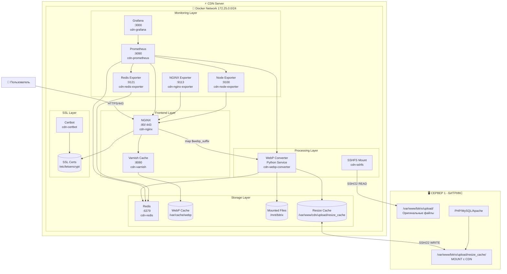

# 🏗️ Архитектура Битрикс CDN Server

**Автор**: Chibilyaev Alexandr | **AAChibilyaev LTD** | info@aachibilyaev.com

## ⚠️ КРИТИЧЕСКИ ВАЖНО: Два физически разных сервера с ДВУСТОРОННИМ монтированием!

### 📍 Сервер 1 - Битрикс (основной)
- **Расположение**: Ваш production сервер
- **Оригиналы**: `/var/www/bitrix/upload/` - оригинальные файлы (iblock, uf)
- **resize_cache**: `/var/www/bitrix/upload/resize_cache/` - MOUNT с CDN сервера!
- **Роль**: Хранение оригиналов, генерация resize_cache (но сохранение на CDN)
- **WebP**: НЕ создает, НЕ хранит

### 📍 Сервер 2 - CDN (этот проект)  
- **Расположение**: Отдельный сервер/VPS
- **Оригиналы**: `/mnt/bitrix/upload/` - READ-ONLY mount с Сервера 1
- **resize_cache**: `/var/www/cdn/upload/resize_cache/` - ЛОКАЛЬНОЕ хранение!
- **WebP кеш**: `/var/cache/webp/` - WebP версии всех изображений
- **Роль**: Хранение resize_cache, конвертация в WebP, отдача оптимизированных изображений

### 🔄 Двустороннее монтирование:
- **CDN → Битрикс**: Монтирует `/upload/` для чтения оригиналов (SSHFS read-only)
- **Битрикс → CDN**: Монтирует `/resize_cache/` для записи превью (SSHFS read-write)

## 📊 Полная схема архитектуры



## 🔄 Компоненты и их взаимодействие

### 1. Frontend Layer

#### NGINX (порты 80, 443)
- **Роль**: Главный веб-сервер и точка входа
- **Функции**:
  - Прием HTTP/HTTPS запросов
  - Проверка поддержки WebP в браузере
  - Маршрутизация к кешу или конвертеру
  - SSL терминация
  - Rate limiting и защита от DDoS

```nginx
# Основная логика обработки (без if в location - nginx.org best practice)
map $http_accept $webp_suffix {
    default "";
    "~*image/webp" ".webp";
}

location ~* \.(jpg|jpeg|png|gif|bmp)$ {
    # Пробуем WebP версию, затем оригинал
    try_files /var/cache/webp$uri$webp_suffix $uri @webp_convert;
}

location @webp_convert {
    # Проксирование на WebP конвертер
    proxy_pass http://webp-converter:8080;
    proxy_set_header X-Original-URI $request_uri;
}
```

#### Varnish Cache (порт 8080)
- **Роль**: HTTP акселератор
- **Функции**:
  - Кеширование в RAM
  - Снижение нагрузки на NGINX
  - Grace mode для отдачи устаревшего кеша

### 2. Processing Layer

#### WebP Converter
- **Язык**: Python 3 + cwebp
- **Функции**:
  - On-the-fly конвертация изображений
  - Оптимизация размера и качества
  - Batch обработка при старте
  - File watcher для новых файлов

```python
# Основные параметры конвертации
QUALITY = 85
MAX_WIDTH = 2048
MAX_HEIGHT = 2048
COMPRESSION_LEVEL = 6
```

#### SSHFS Mount
- **Роль**: Безопасное монтирование файлов
- **Параметры**:
  - Read-only монтирование
  - Auto-reconnect при обрыве
  - Кеширование метаданных

### 3. Storage Layer

#### Redis
- **Роль**: Кеш метаданных
- **Хранит**:
  - Информацию о конвертированных файлах
  - Статистику использования
  - Временные данные обработки

#### Cache Storage
```
/var/cache/webp/
├── upload/
│   ├── iblock/
│   │   ├── 001/
│   │   │   ├── image1.jpg.webp
│   │   │   └── image2.png.webp
│   │   └── 002/
│   └── resize_cache/
└── .metadata/
    └── cache.db
```

### 4. Monitoring Layer

#### Prometheus
- **Метрики**:
  - Request rate
  - Response time (P50, P95, P99)
  - Cache hit ratio
  - Conversion rate
  - Error rate

#### Grafana Dashboards
- CDN Overview
- Performance Metrics
- Cache Statistics
- Error Analysis
- Real-time Monitoring

## 🔐 Сетевая безопасность

### Docker Network Isolation
```yaml
networks:
  cdn-network:
    driver: bridge
    ipam:
      config:
        - subnet: 172.25.0.0/24
```

### Firewall правила
```bash
# Только необходимые порты
-A INPUT -p tcp --dport 80 -j ACCEPT
-A INPUT -p tcp --dport 443 -j ACCEPT
-A INPUT -p tcp --dport 3000 -s 192.168.1.0/24 -j ACCEPT  # Grafana только из локальной сети
```

## 📦 Volumes и персистентность

| Volume | Тип | Описание | Backup |
|--------|-----|----------|--------|
| `bitrix-files` | local | SSHFS mount point | ❌ |
| `webp-cache` | local | Конвертированные изображения | ✅ |
| `redis-data` | local | Redis персистентность | ✅ |
| `prometheus-data` | local | Метрики | ✅ |
| `grafana-data` | local | Дашборды и настройки | ✅ |
| `ssl-certs` | local | SSL сертификаты | ✅ |

## 🔄 Процессы и потоки

### Основной поток обработки
1. **Прием запроса** → NGINX
2. **Проверка кеша** → Varnish/Disk
3. **При промахе** → WebP Converter
4. **Чтение оригинала** → SSHFS Mount
5. **Конвертация** → cwebp
6. **Сохранение** → Cache + Redis
7. **Отдача клиенту** → NGINX

### Background процессы
- **Health checks** - каждые 30 секунд
- **Cache cleanup** - каждые 24 часа
- **Metrics collection** - каждые 15 секунд
- **Log rotation** - каждые 7 дней
- **SSL renewal** - каждые 12 часов проверка

## 🚀 Масштабирование

### Горизонтальное масштабирование
```yaml
# docker-compose.scale.yml
services:
  webp-converter:
    deploy:
      replicas: 3
  
  nginx:
    deploy:
      replicas: 2
```

### Вертикальное масштабирование
```yaml
services:
  webp-converter:
    deploy:
      resources:
        limits:
          cpus: '4'
          memory: 4G
```

## 📊 Ресурсные лимиты

| Сервис | CPU | RAM | Disk I/O |
|--------|-----|-----|----------|
| NGINX | 2 cores | 1GB | unlimited |
| WebP Converter | 2 cores | 2GB | 100MB/s |
| Redis | 1 core | 512MB | 50MB/s |
| Varnish | 2 cores | 1GB | unlimited |
| SSHFS | 0.5 cores | 256MB | network limited |

## 🔧 Конфигурационные файлы

```
bitrix-cdn/
├── docker-compose.yml           # Основная конфигурация
├── docker-compose.prod.yml      # Production overrides
├── docker-compose.scale.yml     # Scaling configuration
├── .env                         # Environment variables
├── docker/
│   ├── nginx/nginx.conf        # NGINX конфигурация
│   ├── nginx/conf.d/*.conf     # Сайты NGINX
│   ├── varnish/default.vcl     # Varnish конфигурация
│   ├── prometheus/prometheus.yml
│   └── grafana/provisioning/
└── configs/
    └── optimization.json        # Параметры оптимизации
```