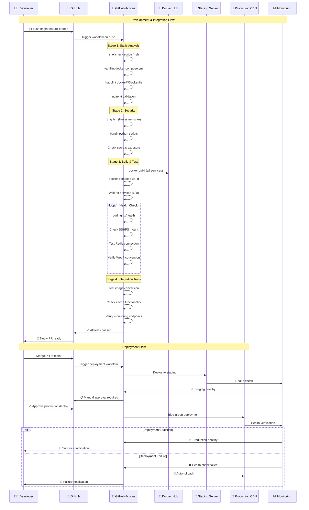
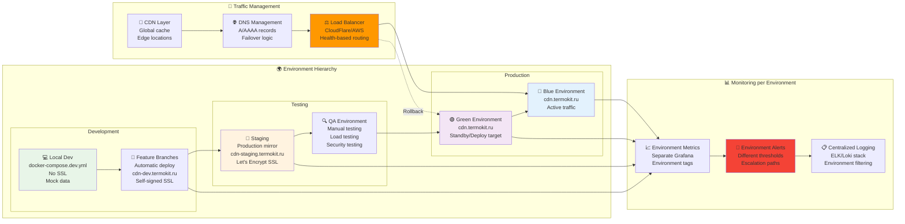
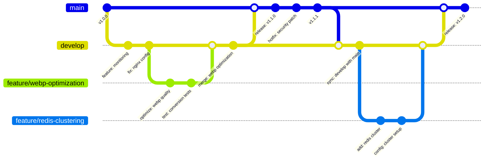
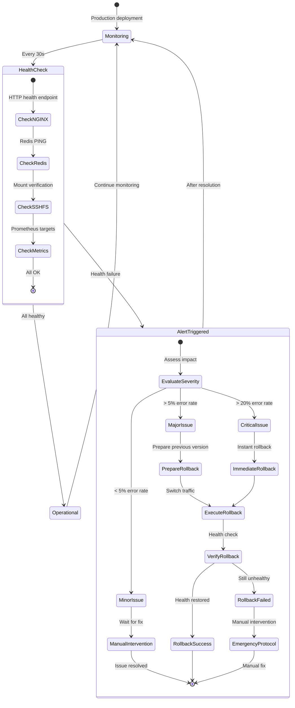
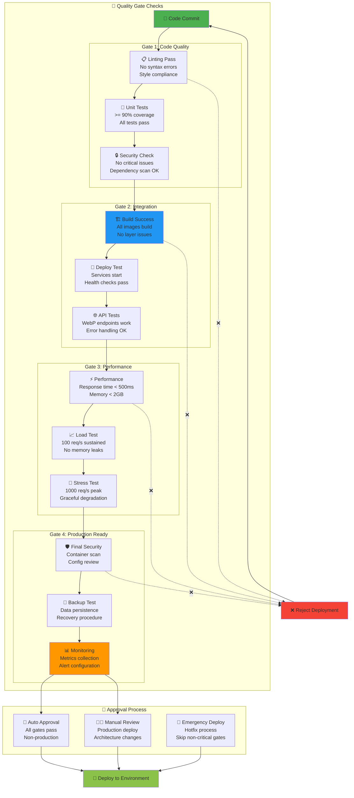

# 🚀 CI/CD Pipeline и GitHub Actions

**Автор**: Chibilyaev Alexandr | **AAChibilyaev LTD** | info@aachibilyaev.com

## 🔄 GitHub Actions Workflow

```mermaid
flowchart TD
    subgraph "💻 Development Process"
        DEV[👨‍💻 Developer<br/>Local Development]
        COMMIT[📝 Git Commit<br/>Feature Branch]
        PUSH[📤 Git Push<br/>to GitHub]
        PR[🔄 Pull Request<br/>to main branch]
    end
    
    subgraph "🤖 GitHub Actions - CI Pipeline"
        TRIGGER[⚡ Workflow Trigger<br/>Push/PR Event]
        
        subgraph "🔍 Code Quality Checks"
            LINT[📋 Lint Check<br/>shellcheck, yamllint<br/>hadolint (Dockerfile)]
            SECURITY[🔒 Security Scan<br/>trivy, bandit<br/>dependency check]
            SYNTAX[✅ Syntax Validation<br/>nginx -t, compose config]
        end
        
        subgraph "🐳 Docker Build & Test"
            BUILD[🏗️ Docker Build<br/>Multi-stage builds<br/>Layer caching]
            UNIT_TEST[🧪 Unit Tests<br/>Python converter<br/>Bash script tests]
            INTEGRATION[🔗 Integration Test<br/>Container connectivity<br/>Health checks]
        end
        
        subgraph "📊 Performance & Security"
            PERF_TEST[⚡ Performance Test<br/>WebP conversion speed<br/>Memory usage checks]
            VULN_SCAN[🛡️ Vulnerability Scan<br/>Container images<br/>Dependencies]
            CONFIG_TEST[⚙️ Config Validation<br/>NGINX, Prometheus<br/>Redis, Grafana]
        end
    end
    
    subgraph "🎯 Deployment Environments"
        DEV_ENV[🧪 Development<br/>Auto-deploy on develop<br/>cdn-dev.termokit.ru]
        STAGING[🚧 Staging<br/>Manual approval<br/>cdn-staging.termokit.ru]
        PRODUCTION[🌟 Production<br/>Manual approval<br/>cdn.termokit.ru]
    end
    
    %% Development flow
    DEV --> COMMIT
    COMMIT --> PUSH
    PUSH --> TRIGGER
    
    %% CI Pipeline
    TRIGGER --> LINT
    TRIGGER --> SECURITY
    TRIGGER --> SYNTAX
    
    LINT --> BUILD
    SECURITY --> BUILD  
    SYNTAX --> BUILD
    
    BUILD --> UNIT_TEST
    UNIT_TEST --> INTEGRATION
    INTEGRATION --> PERF_TEST
    PERF_TEST --> VULN_SCAN
    VULN_SCAN --> CONFIG_TEST
    
    %% Deployment flow
    CONFIG_TEST --> DEV_ENV
    DEV_ENV --> PR
    PR --> STAGING
    STAGING --> PRODUCTION
    
    %% Success paths
    PRODUCTION --> SUCCESS[✅ Deployment Complete<br/>Monitoring Active]
    
    %% Failure paths
    LINT -.->|❌ Fail| FAIL[❌ Pipeline Failed<br/>Fix Issues]
    SECURITY -.->|❌ Fail| FAIL
    BUILD -.->|❌ Fail| FAIL
    INTEGRATION -.->|❌ Fail| FAIL
    VULN_SCAN -.->|❌ Fail| FAIL
    
    FAIL --> DEV

    style DEV fill:#e3f2fd
    style TRIGGER fill:#4caf50
    style BUILD fill:#2196f3
    style PRODUCTION fill:#ff9800
    style SUCCESS fill:#8bc34a
    style FAIL fill:#f44336
```

## 📝 Детальный CI Pipeline

```mermaid
graph TD
    subgraph "🔄 Pull Request Pipeline"
        PR_OPEN[📤 PR Created/Updated]
        
        subgraph "Stage 1: Static Analysis"
            S1_LINT[📋 ShellCheck<br/>Bash scripts validation]
            S1_YAML[📄 YAML Lint<br/>docker-compose validation]
            S1_DOCKER[🐳 Hadolint<br/>Dockerfile best practices]
            S1_NGINX[🌐 NGINX Config Test<br/>nginx -t validation]
        end
        
        subgraph "Stage 2: Security Scanning"
            S2_SECRETS[🔐 Secret Detection<br/>GitLeaks, TruffleHog]
            S2_DEPS[📦 Dependency Scan<br/>npm audit, pip-audit]
            S2_CODE[🛡️ Code Security<br/>bandit (Python), semgrep]
        end
        
        subgraph "Stage 3: Build & Test"
            S3_BUILD[🏗️ Docker Build<br/>All services build test]
            S3_COMPOSE[🐳 Compose Up<br/>Integration test]
            S3_HEALTH[❤️ Health Checks<br/>All services healthy]
            S3_API[🌐 API Tests<br/>WebP conversion test]
        end
        
        subgraph "Stage 4: Performance"
            S4_LOAD[⚡ Load Test<br/>Image conversion stress]
            S4_MEMORY[💾 Memory Test<br/>Resource usage limits]
            S4_DISK[💽 Disk Test<br/>Cache growth simulation]
        end
    end
    
    subgraph "🎯 Deployment Pipeline"
        MERGE[🔄 Merge to Main]
        
        subgraph "Production Deployment"
            DEPLOY_PREP[🎯 Deployment Prep<br/>Tag version<br/>Generate changelog]
            DEPLOY_PROD[🚀 Production Deploy<br/>Zero-downtime<br/>Blue-green strategy]
            DEPLOY_VERIFY[✅ Deployment Verify<br/>Smoke tests<br/>Monitoring checks]
        end
        
        subgraph "Post-deployment"
            MONITOR[👀 Monitoring<br/>Grafana alerts<br/>Performance check]
            ROLLBACK[🔄 Auto Rollback<br/>On failure detection]
            SUCCESS_NOTIFY[📧 Success Notification<br/>Slack/Email alert]
        end
    end
    
    %% Pipeline flow
    PR_OPEN --> S1_LINT
    PR_OPEN --> S1_YAML
    PR_OPEN --> S1_DOCKER
    PR_OPEN --> S1_NGINX
    
    S1_LINT --> S2_SECRETS
    S1_YAML --> S2_DEPS
    S1_DOCKER --> S2_CODE
    S1_NGINX --> S2_SECRETS
    
    S2_SECRETS --> S3_BUILD
    S2_DEPS --> S3_COMPOSE
    S2_CODE --> S3_HEALTH
    
    S3_BUILD --> S3_COMPOSE
    S3_COMPOSE --> S3_HEALTH
    S3_HEALTH --> S3_API
    
    S3_API --> S4_LOAD
    S4_LOAD --> S4_MEMORY
    S4_MEMORY --> S4_DISK
    
    %% Deployment flow
    S4_DISK --> MERGE
    MERGE --> DEPLOY_PREP
    DEPLOY_PREP --> DEPLOY_PROD
    DEPLOY_PROD --> DEPLOY_VERIFY
    
    DEPLOY_VERIFY --> MONITOR
    MONITOR --> SUCCESS_NOTIFY
    
    %% Failure handling
    DEPLOY_VERIFY -.->|❌ Fail| ROLLBACK
    MONITOR -.->|🚨 Alert| ROLLBACK
    ROLLBACK --> DEPLOY_VERIFY

    style PR_OPEN fill:#e3f2fd
    style S3_BUILD fill:#4caf50
    style DEPLOY_PROD fill:#ff9800
    style SUCCESS_NOTIFY fill:#8bc34a
    style ROLLBACK fill:#f44336
```

## 🏗️ Build Process Детализация



## 🧪 Testing Strategy

```mermaid
graph TB
    subgraph "🔬 Test Pyramid"
        subgraph "Unit Tests (Fast)"
            UT_PYTHON[🐍 Python Tests<br/>WebP converter logic<br/>File handling<br/>Error cases]
            UT_BASH[💻 Bash Tests<br/>Script validation<br/>Parameter handling<br/>Edge cases]
            UT_CONFIG[⚙️ Config Tests<br/>NGINX syntax<br/>Docker compose<br/>Environment vars]
        end
        
        subgraph "Integration Tests (Medium)"
            IT_SERVICES[🔗 Service Integration<br/>Container communication<br/>Volume mounting<br/>Network connectivity]
            IT_API[🌐 API Integration<br/>HTTP endpoint tests<br/>WebP conversion flow<br/>Cache behavior]
            IT_HEALTH[❤️ Health Integration<br/>Service dependencies<br/>Startup sequence<br/>Failure recovery]
        end
        
        subgraph "End-to-End Tests (Slow)"
            E2E_USER[👤 User Journey<br/>Full request flow<br/>Image conversion<br/>Cache performance]
            E2E_MONITOR[📊 Monitoring E2E<br/>Metrics collection<br/>Alert generation<br/>Dashboard updates]
            E2E_DEPLOY[🚀 Deployment E2E<br/>Zero-downtime deploy<br/>Rollback testing<br/>Data persistence]
        end
    end
    
    subgraph "🎯 Test Execution Strategy"
        PARALLEL[⚡ Parallel Execution<br/>Unit + Config tests<br/>Fast feedback]
        
        SEQUENTIAL[🔄 Sequential Flow<br/>Integration → E2E<br/>Resource management]
        
        CONDITIONAL[🎛️ Conditional Tests<br/>Performance (on schedule)<br/>Load (on release)]
    end
    
    subgraph "📈 Test Coverage Goals"
        COVERAGE[📊 Coverage Targets<br/>Unit: >90%<br/>Integration: >80%<br/>E2E: Key flows]
        
        QUALITY[🏆 Quality Gates<br/>No critical security issues<br/>All health checks pass<br/>Performance benchmarks met]
    end
    
    %% Test flow
    UT_PYTHON --> PARALLEL
    UT_BASH --> PARALLEL
    UT_CONFIG --> PARALLEL
    
    PARALLEL --> IT_SERVICES
    IT_SERVICES --> IT_API
    IT_API --> IT_HEALTH
    
    IT_HEALTH --> SEQUENTIAL
    SEQUENTIAL --> E2E_USER
    E2E_USER --> E2E_MONITOR
    E2E_MONITOR --> E2E_DEPLOY
    
    E2E_DEPLOY --> CONDITIONAL
    CONDITIONAL --> COVERAGE
    COVERAGE --> QUALITY

    style UT_PYTHON fill:#4caf50
    style IT_SERVICES fill:#2196f3
    style E2E_USER fill:#ff9800
    style QUALITY fill:#9c27b0
    style PARALLEL fill:#8bc34a
```

## 🔧 Deployment Environments



## 🎛️ Release Management



## 🚨 Rollback Strategy



## 🔍 Quality Gates

