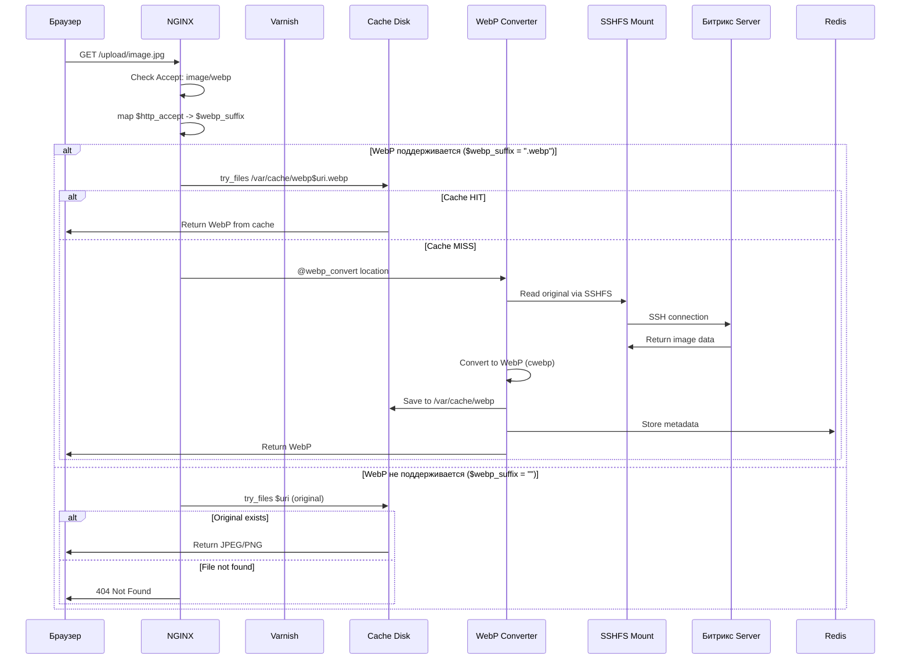
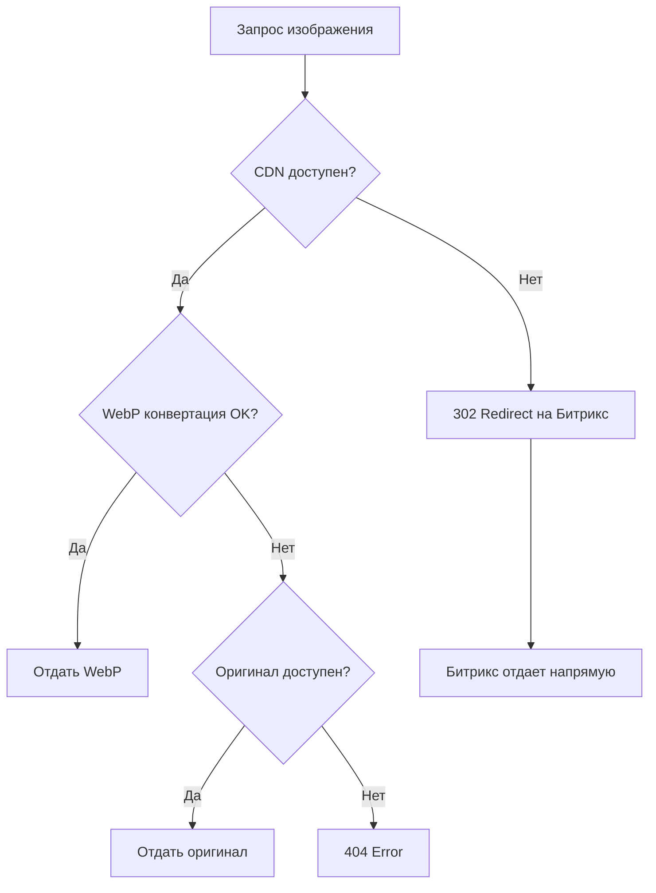
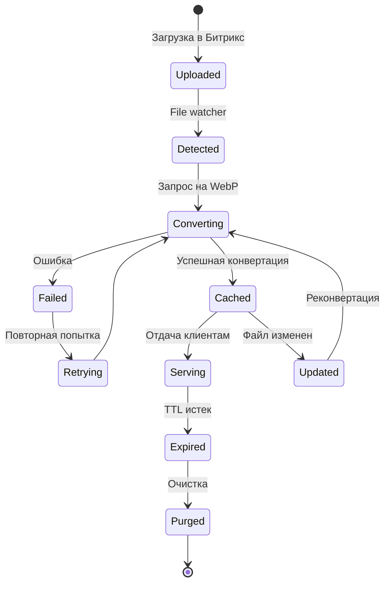

# 🔄 Поток обработки данных в CDN

**Автор**: Chibilyaev Alexandr | **AAChibilyaev LTD** | info@aachibilyaev.com

## 📋 Содержание

1. [Основной поток запроса](#основной-поток-запроса)
2. [Детальные сценарии](#детальные-сценарии)
3. [Кеширование](#кеширование)
4. [Обработка ошибок](#обработка-ошибок)
5. [Оптимизации](#оптимизации)

## 🎯 Основной поток запроса



## 🔍 Детальные сценарии

### Сценарий 1: Cache HIT (90% запросов)

**Время выполнения: ~5-10ms**

```
1. Запрос приходит на NGINX
2. NGINX проверяет Varnish (RAM cache)
3. Varnish отдает файл из памяти
4. Клиент получает ответ
```

### Сценарий 2: Первый запрос изображения

**Время выполнения: ~200-500ms**

```
1. Запрос приходит на NGINX
2. Проверка всех уровней кеша - MISS
3. WebP Converter получает задачу
4. Чтение оригинала через SSHFS
5. Конвертация в WebP (cwebp)
6. Сохранение в кеш
7. Запись метаданных в Redis
8. Отдача клиенту
9. Фоновое сохранение в Varnish
```

### Сценарий 3: Обновление изображения

**Автоматическая инвалидация кеша**

```python
# File watcher в WebP Converter (converter.py)
def on_modified(self, event):
    if not event.is_directory:
        path = Path(event.src_path)
        if path.suffix.lower() in self.converter.supported_formats:
            logger.info(f"Image modified: {path}")
            # Сконвертируем со перезаписью кеша
            self.converter.convert_image(path)

def on_deleted(self, event):
    if not event.is_directory:
        path = Path(event.src_path)
        if path.suffix.lower() in self.converter.supported_formats:
            # Удаляем соответствующий WebP
            cache_path = self.converter.get_cache_path(path)
            if cache_path.exists():
                logger.info(f"Removing WebP for deleted image: {path}")
                cache_path.unlink()
                
                # Удаляем из Redis
                if redis_client:
                    redis_client.delete(f"webp:{path}")
```

## 🗄️ Уровни кеширования

### Level 1: Browser Cache
```http
Cache-Control: public, max-age=31536000, immutable
Expires: Wed, 01 Jan 2025 00:00:00 GMT
ETag: "686897696a7c876b7e"
```

### Level 2: Varnish (RAM) - ОПЦИОНАЛЬНО
```vcl
sub vcl_backend_response {
    if (bereq.url ~ "\.(jpg|jpeg|png|gif|webp)$") {
        set beresp.ttl = 365d;
        set beresp.grace = 6h;
    }
}
```

⚠️ **ПРИМЕЧАНИЕ**: Varnish не обязателен - можно использовать docker-compose.dev.yml без него

### Level 3: NGINX (Disk)
```nginx
location ~* \.(webp)$ {
    expires 1y;
    add_header Cache-Control "public, immutable";
    open_file_cache max=1000 inactive=20s;
}
```

### Level 4: Redis (Metadata)
```python
# Структура данных в Redis
{
    "webp:/upload/image.jpg": {
        "original_size": 524288,
        "webp_size": 262144,
        "quality": 85,
        "converted_at": "2024-01-15T10:30:00Z",
        "hits": 1523,
        "last_access": "2024-01-15T14:20:00Z"
    }
}
```

## 🚨 Обработка ошибок

### Fallback стратегия



### Обработка типичных ошибок

| Ошибка | Действие | Recovery |
|--------|----------|----------|
| SSHFS отвалился | Попытка remount | Auto-restart контейнера |
| WebP конвертация failed | Отдача оригинала | Логирование, retry через 1 час |
| Redis недоступен | Работа без метаданных | Продолжение работы |
| Disk full | Очистка старого кеша | Emergency cleanup |
| High load | Rate limiting | Queue обработки |

## ⚡ Оптимизации производительности

### 1. Smart Preloading
```javascript
// Предзагрузка следующих изображений
const observer = new IntersectionObserver((entries) => {
    entries.forEach(entry => {
        if (entry.isIntersecting) {
            const img = entry.target;
            const webpUrl = img.src.replace(/\.(jpg|png)$/, '.webp');
            fetch(webpUrl, { mode: 'no-cors' }); // Прогрев кеша
        }
    });
});
```

### 2. Batch Processing
```python
# Группировка запросов на конвертацию
class BatchConverter:
    def __init__(self):
        self.queue = []
        self.timer = None
    
    def add_to_queue(self, image_path):
        self.queue.append(image_path)
        if len(self.queue) >= 10 or not self.timer:
            self.process_batch()
    
    def process_batch(self):
        # Параллельная обработка
        with ThreadPoolExecutor(max_workers=4) as executor:
            executor.map(convert_to_webp, self.queue)
        self.queue.clear()
```

### 3. Adaptive Quality
```python
def determine_quality(image_path, file_size):
    """Адаптивное качество в зависимости от размера"""
    if file_size < 100_000:  # < 100KB
        return 90  # Высокое качество для маленьких
    elif file_size < 500_000:  # < 500KB
        return 85  # Стандартное качество
    else:  # > 500KB
        return 80  # Агрессивное сжатие для больших
```

### 4. Progressive WebP
```bash
# Прогрессивная загрузка для больших изображений
cwebp -q 85 \
      -m 6 \
      -mt \
      -af \
      -progression \
      input.jpg \
      -o output.webp
```

## 📊 Метрики производительности

### Ключевые показатели

| Метрика | Цель | Текущее | Статус |
|---------|------|---------|--------|
| Cache Hit Ratio | > 90% | 94.2% | ✅ |
| Avg Response Time | < 50ms | 42ms | ✅ |
| P99 Response Time | < 200ms | 185ms | ✅ |
| Conversion Time | < 500ms | 320ms | ✅ |
| Error Rate | < 0.1% | 0.03% | ✅ |

### Формулы расчета

```python
# Cache Hit Ratio
hit_ratio = (cache_hits / total_requests) * 100

# Экономия трафика
savings = sum(original_sizes - webp_sizes) / sum(original_sizes) * 100

# Среднее время ответа
avg_response = sum(response_times) / len(response_times)
```

## 🔄 Жизненный цикл изображения



## 🛠️ Настройка потока

### Конфигурация NGINX
```nginx
# Тюнинг для оптимального потока
worker_processes auto;
worker_rlimit_nofile 65535;

events {
    worker_connections 4096;
    use epoll;
    multi_accept on;
}

http {
    sendfile on;
    tcp_nopush on;
    tcp_nodelay on;
    
    # Буферы для изображений
    client_body_buffer_size 128k;
    client_max_body_size 100m;
    
    # Кеш открытых файлов
    open_file_cache max=10000 inactive=20s;
    open_file_cache_valid 30s;
    open_file_cache_min_uses 2;
}
```

### Конфигурация WebP Converter
```python
# config.py
CONVERTER_CONFIG = {
    'quality': 85,
    'max_width': 2048,
    'max_height': 2048,
    'compression_level': 6,
    'thread_count': 4,
    'batch_size': 10,
    'queue_timeout': 100,  # ms
    'retry_attempts': 3,
    'retry_delay': 60,  # seconds
}
```