# 🔄 Потоки данных и обработка изображений

**Автор**: Chibilyaev Alexandr | **AAChibilyaev LTD** | info@aachibilyaev.com

## 🎨 Complete Image Processing Pipeline

```mermaid
flowchart TD
    subgraph "🖥️ Bitrix Server (Source)"
        USER_UPLOAD[👤 User Upload<br/>Admin panel<br/>Multiple formats<br/>Various sizes]
        
        BITRIX_STORAGE[📁 Bitrix Storage<br/>/var/www/bitrix/upload/<br/>├── iblock/ (локально)<br/>├── resize_cache/ (mount с CDN)<br/>├── medialibrary/<br/>└── product_images/]
        
        FILE_VALIDATION[✅ File Validation<br/>Format check<br/>Size limits<br/>Security scan]
    end
    
    subgraph "📡 Data Synchronization"
        SSHFS_MOUNT[🔗 SSHFS Mount<br/>Real-time access<br/>Read-only mode<br/>Auto-reconnect]
        
        FILE_WATCHER[👀 File System Watcher<br/>inotify events<br/>New file detection<br/>Change monitoring]
        
        SYNC_STATUS[📊 Sync Health<br/>Connection status<br/>Latency monitoring<br/>Error tracking]
    end
    
    subgraph "🎨 CDN Server Processing"
        REQUEST_HANDLER[🌐 Request Handler<br/>NGINX routing<br/>Accept header check<br/>Cache validation]
        
        subgraph "🔄 WebP Conversion Pipeline"
            QUEUE_MANAGER[📋 Queue Manager<br/>Conversion queue<br/>Priority handling<br/>Rate limiting]
            
            FORMAT_DETECTOR[🔍 Format Detection<br/>MIME type analysis<br/>File signature check<br/>Metadata extraction]
            
            QUALITY_OPTIMIZER[🎯 Quality Optimizer<br/>Dynamic quality<br/>Size vs Quality<br/>Format-specific rules]
            
            WEBP_CONVERTER[🎨 WebP Engine<br/>cwebp binary<br/>Multi-threading<br/>Memory management]
            
            POST_PROCESSOR[✨ Post Processing<br/>Optimization check<br/>Metadata insertion<br/>Quality validation]
        end
        
        subgraph "💾 Caching System"
            CACHE_MANAGER[📦 Cache Manager<br/>Storage allocation<br/>Eviction policies<br/>Cleanup scheduling]
            
            METADATA_STORE[🗃️ Metadata Storage<br/>Redis database<br/>File attributes<br/>Access statistics]
            
            PERFORMANCE_LOG[📊 Performance Log<br/>Conversion time<br/>Size reduction<br/>Success rate]
        end
    end
    
    subgraph "🌐 Content Delivery"
        CACHE_LAYER[⚡ Cache Layer<br/>Varnish HTTP cache<br/>NGINX file cache<br/>Browser cache headers]
        
        CDN_EDGE[☁️ CDN Edge<br/>CloudFlare edge<br/>Geographic distribution<br/>Global acceleration]
        
        CLIENT_DELIVERY[📱 Client Delivery<br/>Optimized images<br/>Progressive loading<br/>Responsive images]
    end
    
    %% Data flow
    USER_UPLOAD --> BITRIX_STORAGE
    BITRIX_STORAGE --> FILE_VALIDATION
    FILE_VALIDATION --> SSHFS_MOUNT
    
    SSHFS_MOUNT --> FILE_WATCHER
    FILE_WATCHER --> SYNC_STATUS
    SYNC_STATUS --> REQUEST_HANDLER
    
    REQUEST_HANDLER --> QUEUE_MANAGER
    QUEUE_MANAGER --> FORMAT_DETECTOR
    FORMAT_DETECTOR --> QUALITY_OPTIMIZER
    QUALITY_OPTIMIZER --> WEBP_CONVERTER
    WEBP_CONVERTER --> POST_PROCESSOR
    
    POST_PROCESSOR --> CACHE_MANAGER
    CACHE_MANAGER --> METADATA_STORE
    METADATA_STORE --> PERFORMANCE_LOG
    
    CACHE_MANAGER --> CACHE_LAYER
    CACHE_LAYER --> CDN_EDGE
    CDN_EDGE --> CLIENT_DELIVERY

    style USER_UPLOAD fill:#e3f2fd
    style WEBP_CONVERTER fill:#2196f3
    style CACHE_MANAGER fill:#4caf50
    style CDN_EDGE fill:#ff9800
    style PERFORMANCE_LOG fill:#9c27b0
```

## 📊 Data Flow State Management


## 🔄 Real-time Processing Architecture


## 🔄 Resize Cache Processing Flow

```mermaid
flowchart LR
    subgraph "🖥️ Server 1 - Bitrix"
        ORIG[Original Image<br/>/upload/iblock/]
        PHP[PHP Processing]
        RESIZE_GEN[Resize Generation<br/>CFile::ResizeImageGet]
        MOUNT_POINT[/upload/resize_cache/<br/>SSHFS Mount Point]
    end
    
    subgraph "⚡ Server 2 - CDN"
        LOCAL_RESIZE[/var/www/cdn/upload/resize_cache/<br/>Local Storage]
        WEBP_CONV[WebP Converter<br/>Creates .webp versions]
        WEBP_CACHE[/var/cache/webp/upload/resize_cache/]
    end
    
    ORIG --> PHP
    PHP --> RESIZE_GEN
    RESIZE_GEN -->|Writes via SSHFS| MOUNT_POINT
    MOUNT_POINT -.->|Physical Storage| LOCAL_RESIZE
    LOCAL_RESIZE --> WEBP_CONV
    WEBP_CONV --> WEBP_CACHE
    
    style RESIZE_GEN fill:#ff9800
    style LOCAL_RESIZE fill:#4caf50
    style WEBP_CONV fill:#2196f3
```

## 🔀 Data Transformation Workflow

```mermaid
sequenceDiagram
    participant Bitrix as 🖥️ Bitrix Server
    participant SSHFS as 📂 SSHFS Client
    participant Watcher as 👀 File Watcher
    participant Queue as 📋 Task Queue
    participant Worker as 👷 Worker Process
    participant Analyzer as 🔍 Image Analyzer
    participant Converter as 🎨 WebP Converter
    participant Cache as 💾 Cache Manager
    participant Redis as 🔴 Redis Store
    participant NGINX as 🌐 NGINX Server
    participant Client as 👤 Client
    
    Note over Bitrix,Client: Image Processing & Delivery Flow
    
    rect rgb(240, 248, 255)
        Note right of Bitrix: File Upload & Detection
        Bitrix->>Bitrix: User uploads image.jpg
        Bitrix->>SSHFS: File available via SSH
        SSHFS->>Watcher: inotify: new file detected
        Watcher->>Queue: Add conversion task
    end
    
    rect rgb(245, 255, 245)
        Note right of Queue: Processing Pipeline
        Queue->>Worker: Assign task to worker
        Worker->>Analyzer: Analyze source image
        
        Analyzer->>Analyzer: Extract metadata<br/>Format: JPEG<br/>Size: 2.5MB<br/>Dimensions: 1920x1080
        
        Analyzer->>Converter: Optimize conversion params<br/>Quality: 85<br/>Method: 6<br/>Threading: enabled
        
        Converter->>Converter: Execute cwebp conversion<br/>Input: image.jpg (2.5MB)<br/>Output: image.jpg.webp (1.2MB)<br/>Savings: 52%
        
        Converter->>Cache: Save WebP file
        Cache->>Redis: Store metadata<br/>{"format": "webp", "size": 1228800, "created": timestamp}
        
        Redis-->>Worker: Conversion registered
        Worker-->>Queue: Task completed
    end
    
    rect rgb(255, 248, 240)
        Note right of Client: Request & Delivery
        Client->>NGINX: GET /upload/iblock/001/image.jpg<br/>Accept: image/webp,*/*
        
        NGINX->>Cache: Check WebP cache
        Cache-->>NGINX: WebP file found
        
        NGINX->>Client: 200 OK<br/>Content-Type: image/webp<br/>Content-Length: 1228800<br/>Cache-Control: public, max-age=31536000
        
        Note over Client: Client receives optimized WebP<br/>52% smaller than original<br/>Same visual quality
    end
    
    rect rgb(248, 240, 255)
        Note right of Cache: Background Maintenance
        Cache->>Cache: Daily cleanup scan
        Cache->>Redis: Query access statistics
        Redis-->>Cache: File access data
        Cache->>Cache: Remove files not accessed > 30 days
        Cache->>Redis: Update cache statistics
    end
```



## 🎯 Quality & Optimization Engine

```mermaid
graph TB
    subgraph "🎨 Dynamic Quality Optimization"
        subgraph "Input Analysis"
            FORMAT_DETECT[🔍 Format Detection<br/>JPEG, PNG, GIF, BMP<br/>Metadata extraction<br/>Color profile analysis]
            
            SIZE_ANALYSIS[📏 Size Analysis<br/>File size categories<br/>< 100KB: Quality 90<br/>< 1MB: Quality 85<br/>> 1MB: Quality 80]
            
            CONTENT_ANALYSIS[🖼️ Content Analysis<br/>Image complexity<br/>Color depth<br/>Compression potential]
            
            USAGE_PATTERN[📊 Usage Pattern<br/>Access frequency<br/>Geographic distribution<br/>Device types]
        end
        
        subgraph "Quality Decision Matrix"
            QUALITY_RULES[📋 Quality Rules<br/>Format-specific rules<br/>Size-based adjustments<br/>Content-aware optimization]
            
            SETTINGS_CALC[🧮 Settings Calculator<br/>Quality: 75-95<br/>Method: 4-6<br/>Threading: auto]
            
            VALIDATION[✅ Pre-conversion Validation<br/>Parameter bounds check<br/>Resource availability<br/>Queue position]
        end
        
        subgraph "Conversion Execution"
            WEBP_ENGINE[🎨 cwebp Engine<br/>Google WebP library<br/>Multi-threaded processing<br/>Memory management]
            
            PROGRESS_MONITOR[📊 Progress Monitor<br/>Conversion tracking<br/>Resource usage<br/>ETA calculation]
            
            ERROR_HANDLER[🚨 Error Handler<br/>Timeout handling<br/>Memory overflow<br/>Format compatibility]
        end
        
        subgraph "Output Optimization"
            SIZE_VALIDATOR[📏 Size Validator<br/>Size reduction check<br/>Minimum 10% savings<br/>Fallback to original]
            
            QUALITY_VALIDATOR[✨ Quality Validator<br/>SSIM comparison<br/>Visual quality check<br/>Acceptable degradation]
            
            METADATA_INJECTOR[🏷️ Metadata Injector<br/>EXIF preservation<br/>WebP metadata<br/>Cache headers]
        end
    end
    
    subgraph "🔄 Feedback & Learning"
        PERFORMANCE_DATA[📊 Performance Data<br/>Conversion time<br/>Size reduction<br/>Quality scores]
        
        USER_FEEDBACK[👤 User Feedback<br/>Image load times<br/>Visual satisfaction<br/>Bandwidth savings]
        
        ML_OPTIMIZER[🧠 ML Optimizer<br/>Pattern recognition<br/>Parameter optimization<br/>Predictive quality]
        
        RULES_UPDATE[🔧 Rules Update<br/>Dynamic rule adjustment<br/>A/B testing<br/>Continuous improvement]
    end
    
    %% Analysis flow
    FORMAT_DETECT --> SIZE_ANALYSIS
    SIZE_ANALYSIS --> CONTENT_ANALYSIS
    CONTENT_ANALYSIS --> USAGE_PATTERN
    
    %% Quality decision flow
    USAGE_PATTERN --> QUALITY_RULES
    QUALITY_RULES --> SETTINGS_CALC
    SETTINGS_CALC --> VALIDATION
    
    %% Conversion flow
    VALIDATION --> WEBP_ENGINE
    WEBP_ENGINE --> PROGRESS_MONITOR
    PROGRESS_MONITOR --> ERROR_HANDLER
    
    %% Output flow
    ERROR_HANDLER --> SIZE_VALIDATOR
    SIZE_VALIDATOR --> QUALITY_VALIDATOR
    QUALITY_VALIDATOR --> METADATA_INJECTOR
    
    %% Feedback flow
    METADATA_INJECTOR --> PERFORMANCE_DATA
    PERFORMANCE_DATA --> USER_FEEDBACK
    USER_FEEDBACK --> ML_OPTIMIZER
    ML_OPTIMIZER --> RULES_UPDATE
    
    %% Learning loop
    RULES_UPDATE --> QUALITY_RULES

    style FORMAT_DETECT fill:#4caf50
    style WEBP_ENGINE fill:#2196f3
    style SIZE_VALIDATOR fill:#ff9800
    style ML_OPTIMIZER fill:#9c27b0
    style PERFORMANCE_DATA fill:#8bc34a
```



## 📊 Cache Intelligence & Analytics

```mermaid
graph LR
    subgraph "🧠 Cache Intelligence System"
        subgraph "Data Collection"
            ACCESS_LOG[📋 Access Logging<br/>Request patterns<br/>Geographic data<br/>User agents<br/>Referrer analysis]
            
            PERFORMANCE_METRICS[📊 Performance Metrics<br/>Hit/miss ratios<br/>Response times<br/>Bandwidth savings<br/>Conversion efficiency]
            
            BUSINESS_METRICS[💼 Business Metrics<br/>Cost per request<br/>Storage efficiency<br/>User satisfaction<br/>SEO impact]
        end
        
        subgraph "Analytics Engine"
            PATTERN_RECOGNITION[🔍 Pattern Recognition<br/>Traffic patterns<br/>Popular content<br/>Geographic hotspots<br/>Time-based trends]
            
            PREDICTIVE_MODEL[🔮 Predictive Modeling<br/>Cache hit prediction<br/>Content popularity<br/>Resource demand<br/>Scaling triggers]
            
            OPTIMIZATION_AI[🤖 AI Optimization<br/>Quality vs Size<br/>Conversion parameters<br/>Cache strategies<br/>Performance tuning]
        end
        
        subgraph "Decision Making"
            CACHE_POLICY[📋 Cache Policy Engine<br/>TTL calculation<br/>Eviction decisions<br/>Pre-warming rules<br/>Quality adjustment]
            
            RESOURCE_ALLOCATION[🎯 Resource Allocation<br/>Worker assignment<br/>Priority queuing<br/>Capacity planning<br/>Cost optimization]
            
            QUALITY_CONTROL[✨ Quality Control<br/>Dynamic quality<br/>Format selection<br/>Compression levels<br/>User experience</br>]
        end
    end
    
    subgraph "🔄 Adaptive Systems"
        subgraph "Self-Optimization"
            AUTO_TUNING[🎛️ Auto-tuning<br/>Parameter optimization<br/>Performance feedback<br/>Continuous improvement<br/>A/B testing]
            
            SELF_HEALING[🏥 Self-healing<br/>Error detection<br/>Automatic recovery<br/>Service restart<br/>Failover management]
            
            CAPACITY_SCALING[📈 Capacity Scaling<br/>Demand prediction<br/>Proactive scaling<br/>Resource optimization<br/>Cost management]
        end
        
        subgraph "Learning Systems"
            FEEDBACK_LOOP[🔄 Feedback Loop<br/>User behavior analysis<br/>Performance correlation<br/>Strategy refinement<br/>Model updating]
            
            KNOWLEDGE_BASE[📚 Knowledge Base<br/>Best practices<br/>Optimization rules<br/>Failure patterns<br/>Success metrics]
            
            CONTINUOUS_LEARNING[🎓 Continuous Learning<br/>Online learning<br/>Model adaptation<br/>Pattern evolution<br/>Strategy enhancement]
        end
    end
    
    subgraph "📈 Performance Optimization Loop"
        MEASURE[📊 Measure<br/>Real-time metrics<br/>Performance baselines<br/>User satisfaction<br/>Business impact]
        
        ANALYZE[🔬 Analyze<br/>Data correlation<br/>Bottleneck identification<br/>Opportunity detection<br/>Root cause analysis]
        
        OPTIMIZE[🔧 Optimize<br/>Parameter adjustment<br/>Algorithm improvement<br/>Resource reallocation<br/>Strategy refinement]
        
        VALIDATE[✅ Validate<br/>A/B testing<br/>Performance comparison<br/>Impact assessment<br/>Risk evaluation]
    end
    
    %% Data flow
    ACCESS_LOG --> PATTERN_RECOGNITION
    PERFORMANCE_METRICS --> PREDICTIVE_MODEL
    BUSINESS_METRICS --> OPTIMIZATION_AI
    
    %% Analysis to decisions
    PATTERN_RECOGNITION --> CACHE_POLICY
    PREDICTIVE_MODEL --> RESOURCE_ALLOCATION
    OPTIMIZATION_AI --> QUALITY_CONTROL
    
    %% Decisions to adaptive systems
    CACHE_POLICY --> AUTO_TUNING
    RESOURCE_ALLOCATION --> SELF_HEALING
    QUALITY_CONTROL --> CAPACITY_SCALING
    
    %% Adaptive to learning
    AUTO_TUNING --> FEEDBACK_LOOP
    SELF_HEALING --> KNOWLEDGE_BASE
    CAPACITY_SCALING --> CONTINUOUS_LEARNING
    
    %% Learning to optimization loop
    FEEDBACK_LOOP --> MEASURE
    KNOWLEDGE_BASE --> ANALYZE
    CONTINUOUS_LEARNING --> OPTIMIZE
    
    %% Optimization loop
    MEASURE --> ANALYZE
    ANALYZE --> OPTIMIZE
    OPTIMIZE --> VALIDATE
    VALIDATE --> MEASURE

    style PATTERN_RECOGNITION fill:#4caf50
    style PREDICTIVE_MODEL fill:#2196f3
    style AUTO_TUNING fill:#ff9800
    style CONTINUOUS_LEARNING fill:#9c27b0
    style MEASURE fill:#8bc34a
```



## 🎪 Advanced Data Processing Features

```mermaid
graph TB
    subgraph "🚀 Advanced Processing Capabilities"
        subgraph "Intelligent Image Processing"
            AI_ENHANCEMENT[🤖 AI Enhancement<br/>Upscaling algorithms<br/>Noise reduction<br/>Sharpness optimization<br/>Color correction]
            
            FORMAT_OPTIMIZATION[📊 Format Optimization<br/>AVIF support<br/>HEIC conversion<br/>Progressive JPEG<br/>Responsive images]
            
            SMART_CROPPING[✂️ Smart Cropping<br/>Face detection<br/>Object recognition<br/>Rule of thirds<br/>Aspect ratio optimization]
            
            LAZY_PROCESSING[💤 Lazy Processing<br/>On-demand conversion<br/>Background processing<br/>Queue prioritization<br/>Resource scheduling]
        end
        
        subgraph "Content Delivery Optimization"
            ADAPTIVE_DELIVERY[🎯 Adaptive Delivery<br/>Device detection<br/>Connection speed<br/>Progressive enhancement<br/>Fallback strategies]
            
            CDN_OPTIMIZATION[☁️ CDN Optimization<br/>Edge computing<br/>Regional caching<br/>Bandwidth optimization<br/>Latency reduction]
            
            COMPRESSION_ENGINE[🗜️ Compression Engine<br/>Multi-format support<br/>Quality adaptation<br/>Size optimization<br/>Lossless detection]
        end
    end
    
    subgraph "📊 Real-time Analytics"
        subgraph "Performance Analytics"
            CONVERSION_ANALYTICS[📈 Conversion Analytics<br/>Success rates<br/>Processing time<br/>Quality metrics<br/>Size reduction]
            
            USER_ANALYTICS[👥 User Analytics<br/>Geographic distribution<br/>Device capabilities<br/>Browser support<br/>Loading patterns]
            
            BUSINESS_ANALYTICS[💼 Business Analytics<br/>Bandwidth savings<br/>Storage efficiency<br/>Cost reduction<br/>Performance impact]
        end
        
        subgraph "Operational Analytics"
            RESOURCE_ANALYTICS[🔧 Resource Analytics<br/>CPU utilization<br/>Memory efficiency<br/>I/O patterns<br/>Network usage]
            
            ERROR_ANALYTICS[🚨 Error Analytics<br/>Failure patterns<br/>Error classification<br/>Recovery metrics<br/>Impact analysis]
            
            OPTIMIZATION_ANALYTICS[🎯 Optimization Analytics<br/>Performance improvements<br/>Cost effectiveness<br/>User experience<br/>Technical metrics]
        end
    end
    
    subgraph "🔄 Continuous Optimization"
        ML_PIPELINE[🧠 ML Pipeline<br/>Data preprocessing<br/>Feature engineering<br/>Model training<br/>Inference serving]
        
        AUTO_OPTIMIZATION[⚙️ Auto-optimization<br/>Parameter tuning<br/>A/B testing<br/>Performance validation<br/>Rollback capability]
        
        FEEDBACK_SYSTEM[🔄 Feedback System<br/>User behavior analysis<br/>Performance correlation<br/>Business impact<br/>Strategy adjustment]
    end
    
    %% Processing flow
    AI_ENHANCEMENT --> FORMAT_OPTIMIZATION
    FORMAT_OPTIMIZATION --> SMART_CROPPING
    SMART_CROPPING --> LAZY_PROCESSING
    
    ADAPTIVE_DELIVERY --> CDN_OPTIMIZATION
    CDN_OPTIMIZATION --> COMPRESSION_ENGINE
    
    %% Analytics flow
    LAZY_PROCESSING --> CONVERSION_ANALYTICS
    COMPRESSION_ENGINE --> USER_ANALYTICS
    
    CONVERSION_ANALYTICS --> BUSINESS_ANALYTICS
    USER_ANALYTICS --> RESOURCE_ANALYTICS
    BUSINESS_ANALYTICS --> ERROR_ANALYTICS
    RESOURCE_ANALYTICS --> OPTIMIZATION_ANALYTICS
    
    %% Optimization flow
    ERROR_ANALYTICS --> ML_PIPELINE
    OPTIMIZATION_ANALYTICS --> AUTO_OPTIMIZATION
    ML_PIPELINE --> FEEDBACK_SYSTEM
    AUTO_OPTIMIZATION --> FEEDBACK_SYSTEM
    
    %% Feedback to processing
    FEEDBACK_SYSTEM --> AI_ENHANCEMENT
    FEEDBACK_SYSTEM --> ADAPTIVE_DELIVERY

    style AI_ENHANCEMENT fill:#9c27b0
    style CONVERSION_ANALYTICS fill:#4caf50
    style ML_PIPELINE fill:#2196f3
    style ADAPTIVE_DELIVERY fill:#ff9800
    style FEEDBACK_SYSTEM fill:#8bc34a
```

