# 🐳 Docker Архитектура Bitrix CDN

**Автор**: Chibilyaev Alexandr | **AAChibilyaev LTD** | info@aachibilyaev.com

## 🏗️ Полная схема Docker архитектуры

```mermaid
graph TB
    subgraph "🌐 EXTERNAL"
        USER[👤 Пользователи<br/>cdn.termokit.ru]
        BITRIX[🖥️ Битрикс Сервер<br/>192.168.1.10<br/>SSH:22<br/>resize_cache mounted from CDN]
        DNS[🌍 DNS<br/>cdn.termokit.ru → IP]
        LETSENCRYPT[🔐 Let's Encrypt<br/>SSL Certs]
    end
    
    subgraph "🐳 DOCKER HOST - CDN SERVER"
        subgraph "📡 Network: cdn-network (172.25.0.0/24)"
            subgraph "🚀 Frontend Tier"
                NGINX[🌐 NGINX<br/>nginx:1.27-alpine<br/>cdn-nginx<br/>:80,:443]
                VARNISH[⚡ Varnish<br/>varnish:7.5-alpine<br/>cdn-varnish<br/>:8080]
            end
            
            subgraph "🔄 Processing Tier"
                CONVERTER[🎨 WebP Converter<br/>Custom Python<br/>cdn-webp-converter<br/>watchdog + cwebp]
                SSHFS[📂 SSHFS Client<br/>Custom Alpine<br/>cdn-sshfs<br/>fuse mount]
            end
            
            subgraph "💾 Data Tier"
                REDIS[🔴 Redis Cache<br/>redis:7.4-alpine<br/>cdn-redis<br/>:6379]
            end
            
            subgraph "📊 Monitoring Tier"
                PROMETHEUS[📈 Prometheus<br/>prom/prometheus:v2.53.2<br/>cdn-prometheus<br/>:9090]
                GRAFANA[📊 Grafana<br/>grafana/grafana:11.2.2<br/>cdn-grafana<br/>:3000]
                NGINX_EXP[📊 NGINX Exporter<br/>nginx-prometheus-exporter<br/>cdn-nginx-exporter<br/>:9113]
                REDIS_EXP[📊 Redis Exporter<br/>redis_exporter:v1.55.0<br/>cdn-redis-exporter<br/>:9121]
                NODE_EXP[📊 Node Exporter<br/>node-exporter:v1.7.0<br/>cdn-node-exporter<br/>:9100]
            end
            
            subgraph "🔐 Security Tier"
                CERTBOT[🔒 Certbot<br/>certbot:v2.11.0<br/>cdn-certbot<br/>auto-renew]
            end
        end
        
        subgraph "💽 Docker Volumes"
            VOL_BITRIX[📁 bitrix-files<br/>SSHFS Mount Point<br/>/mnt/bitrix]
            VOL_RESIZE[📂 resize-cache<br/>Resize Cache Storage<br/>/var/www/cdn/upload/resize_cache]
            VOL_WEBP[🎨 webp-cache<br/>WebP Cache<br/>/var/cache/webp]
            VOL_REDIS[🔴 redis-data<br/>Redis Persistence<br/>/data]
            VOL_PROMETHEUS[📈 prometheus-data<br/>Metrics Storage<br/>/prometheus]
            VOL_GRAFANA[📊 grafana-data<br/>Dashboards<br/>/var/lib/grafana]
        end
        
        subgraph "📝 Host Mounts"
            HOST_LOGS[📋 ./logs/<br/>Application Logs]
            HOST_SSL[🔐 ./docker/ssl/<br/>SSL Certificates]
            HOST_CONFIGS[⚙️ ./docker/*/conf/<br/>Configurations]
        end
    end
    
    %% External connections
    USER -->|HTTPS:443| NGINX
    DNS --> USER
    LETSENCRYPT --> CERTBOT
    BITRIX -->|SSH:22 READ| SSHFS
    VOL_RESIZE <-->|SSH:22 WRITE| BITRIX
    
    %% Internal connections
    NGINX --> VARNISH
    VARNISH --> CONVERTER
    NGINX --> CONVERTER
    CONVERTER --> VOL_WEBP
    CONVERTER --> REDIS
    SSHFS --> VOL_BITRIX
    SSHFS --> BITRIX
    CERTBOT --> VOL_SSL
    NGINX --> VOL_SSL
    
    %% Monitoring connections
    PROMETHEUS --> NGINX_EXP
    PROMETHEUS --> REDIS_EXP
    PROMETHEUS --> NODE_EXP
    NGINX_EXP --> NGINX
    REDIS_EXP --> REDIS
    GRAFANA --> PROMETHEUS
    
    %% Volume connections
    NGINX -.-> VOL_BITRIX
    CONVERTER -.-> VOL_BITRIX
    NGINX -.-> VOL_RESIZE
    CONVERTER -.-> VOL_RESIZE
    REDIS -.-> VOL_REDIS
    PROMETHEUS -.-> VOL_PROMETHEUS
    GRAFANA -.-> VOL_GRAFANA
    
    %% Host mount connections
    NGINX -.-> HOST_LOGS
    CONVERTER -.-> HOST_LOGS
    NGINX -.-> HOST_CONFIGS
    NGINX -.-> HOST_SSL

    style USER fill:#e1f5fe
    style BITRIX fill:#fff3e0
    style NGINX fill:#4caf50
    style CONVERTER fill:#2196f3
    style REDIS fill:#f44336
    style PROMETHEUS fill:#ff9800
    style GRAFANA fill:#9c27b0
```



## 🔌 Docker Network Configuration


## 📦 Container Dependencies & Startup Order

```mermaid
graph TD
    START([🚀 docker-compose up])
    
    %% Base containers
    START --> REDIS[🔴 Redis<br/>Independent]
    START --> SSHFS[📂 SSHFS<br/>Independent]
    
    %% Dependent containers
    REDIS --> CONVERTER[🎨 WebP Converter<br/>depends_on: redis]
    CONVERTER --> NGINX[🌐 NGINX<br/>depends_on: webp-converter, sshfs]
    SSHFS --> NGINX
    
    NGINX --> VARNISH[⚡ Varnish<br/>depends_on: nginx]
    NGINX --> NGINX_EXP[📊 NGINX Exporter<br/>depends_on: nginx]
    REDIS --> REDIS_EXP[📊 Redis Exporter<br/>depends_on: redis]
    
    %% Monitoring stack
    NGINX --> PROMETHEUS[📈 Prometheus<br/>depends_on: exporters]
    NGINX_EXP --> PROMETHEUS
    REDIS_EXP --> PROMETHEUS
    START --> NODE_EXP[📊 Node Exporter<br/>Independent]
    NODE_EXP --> PROMETHEUS
    
    PROMETHEUS --> GRAFANA[📊 Grafana<br/>depends_on: prometheus]
    
    %% SSL
    START --> CERTBOT[🔒 Certbot<br/>Independent]
    
    %% Health checks
    NGINX --> HEALTH_CHECK{✅ Health Checks<br/>Every 30s}
    SSHFS --> HEALTH_CHECK
    REDIS --> HEALTH_CHECK
    CONVERTER --> HEALTH_CHECK
    
    style START fill:#4caf50
    style NGINX fill:#2196f3
    style CONVERTER fill:#ff9800
    style REDIS fill:#f44336
    style PROMETHEUS fill:#ff5722
    style GRAFANA fill:#9c27b0
    style HEALTH_CHECK fill:#8bc34a
```



## 🔄 Container Lifecycle & Health Checks


## 🎯 Resource Allocation & Limits

```mermaid
%%{init: {'sankey': {'nodeAlignment': 'left'}}}%%
sankey-beta

    8GB RAM,8 CPU Cores,100GB Disk,cdn-nginx,2GB RAM
    8GB RAM,cdn-webp-converter,2GB RAM
    8GB RAM,cdn-redis,512MB RAM
    8GB RAM,cdn-prometheus,1GB RAM
    8GB RAM,cdn-grafana,1GB RAM
    8GB RAM,cdn-varnish,1GB RAM
    8GB RAM,Other Services,0.5GB RAM
    
    8 CPU Cores,cdn-nginx,2 cores
    8 CPU Cores,cdn-webp-converter,2 cores
    8 CPU Cores,cdn-redis,1 core
    8 CPU Cores,cdn-prometheus,1 core
    8 CPU Cores,Other Services,2 cores
    
    100GB Disk,webp-cache,60GB
    100GB Disk,prometheus-data,15GB
    100GB Disk,grafana-data,5GB
    100GB Disk,redis-data,5GB
    100GB Disk,logs,10GB
    100GB Disk,Other,5GB
```