# 📊 Мониторинг и метрики Bitrix CDN

**Автор**: Chibilyaev Alexandr | **AAChibilyaev LTD** | info@aachibilyaev.com

## 📈 Полная схема мониторинга


## 🎛️ Dashboards и метрики

```mermaid
graph LR
    subgraph "📊 Grafana Dashboards"
        subgraph "🌟 Main Dashboard"
            OVERVIEW[📈 CDN Overview<br/>• Request rate<br/>• Active connections<br/>• Cache hit ratio<br/>• Disk usage]
        end
        
        subgraph "🔍 Detailed Dashboards"
            NGINX_DASH[🌐 NGINX Details<br/>• Request distribution<br/>• Response times<br/>• Error analysis<br/>• Geographic stats]
            
            WEBP_DASH[🎨 WebP Analytics<br/>• Conversion metrics<br/>• Quality settings<br/>• File size savings<br/>• Processing queue]
            
            SYSTEM_DASH[🖥️ System Health<br/>• CPU/Memory/Disk<br/>• Container resources<br/>• Network I/O<br/>• Volume usage]
            
            CACHE_DASH[💾 Cache Analytics<br/>• Hit/miss ratio<br/>• Storage growth<br/>• Cleanup events<br/>• Performance trends]
        end
        
        subgraph "🚨 Alert Dashboard"
            ALERTS[🚨 Active Alerts<br/>• Current issues<br/>• Alert history<br/>• Escalation status<br/>• Resolution times]
        end
    end
    
    subgraph "📊 Key Performance Indicators"
        subgraph "🎯 Business KPIs"
            AVAILABILITY[🌟 Availability<br/>Target: 99.9%<br/>Current: 99.95%]
            
            CONVERSION_RATE[🎨 WebP Success Rate<br/>Target: >95%<br/>Current: 98.2%]
            
            RESPONSE_TIME[⚡ Response Time<br/>Target: <500ms<br/>P95: 320ms]
            
            CACHE_EFFICIENCY[💾 Cache Efficiency<br/>Target: >80% hits<br/>Current: 85.6%]
        end
        
        subgraph "🔧 Technical KPIs"
            CPU_USAGE[💻 CPU Usage<br/>Target: <70%<br/>Current: 45%]
            
            MEMORY_USAGE[💾 Memory Usage<br/>Target: <80%<br/>Current: 62%]
            
            DISK_GROWTH[💽 Cache Growth<br/>Target: <5GB/day<br/>Current: 2.1GB/day]
            
            ERROR_RATE[❌ Error Rate<br/>Target: <0.1%<br/>Current: 0.03%]
        end
    end
    
    %% Dashboard relationships
    OVERVIEW --> NGINX_DASH
    OVERVIEW --> WEBP_DASH
    OVERVIEW --> SYSTEM_DASH
    OVERVIEW --> CACHE_DASH
    
    NGINX_DASH --> ALERTS
    WEBP_DASH --> ALERTS
    SYSTEM_DASH --> ALERTS
    CACHE_DASH --> ALERTS
    
    %% KPI connections
    OVERVIEW -.-> AVAILABILITY
    WEBP_DASH -.-> CONVERSION_RATE
    NGINX_DASH -.-> RESPONSE_TIME
    CACHE_DASH -.-> CACHE_EFFICIENCY
    SYSTEM_DASH -.-> CPU_USAGE
    SYSTEM_DASH -.-> MEMORY_USAGE

    style OVERVIEW fill:#4caf50
    style ALERTS fill:#f44336
    style AVAILABILITY fill:#8bc34a
    style ERROR_RATE fill:#ffeb3b
```



## 🚨 Alert Rules и Escalation

```mermaid
flowchart TD
    subgraph "🔔 Alert Sources"
        METRICS[📊 Metric Thresholds<br/>CPU > 80%<br/>Memory > 90%<br/>Disk > 85%]
        
        HEALTH[❤️ Health Checks<br/>Service down > 1min<br/>Mount failed<br/>Connection timeout]
        
        BUSINESS[💼 Business Rules<br/>Error rate > 0.1%<br/>Response time > 1s<br/>Conversion fail > 5%]
        
        CUSTOM[🎯 Custom Events<br/>Cache cleanup failed<br/>SSL cert expiry<br/>SSHFS reconnects > 10]
    end
    
    subgraph "⚡ Alert Processing"
        PROMETHEUS_EVAL[📈 Prometheus<br/>Alert Evaluation<br/>15s interval]
        
        GROUPING[📋 Alert Grouping<br/>By: service, severity<br/>Wait: 30s<br/>Repeat: 12h]
        
        ROUTING[🎯 Alert Routing<br/>Critical → immediate<br/>Warning → 5min delay<br/>Info → 1h summary]
    end
    
    subgraph "📢 Notification Channels"
        subgraph "Critical Alerts (< 1min)"
            EMAIL_CRIT[📧 Email<br/>admin@termokit.ru<br/>ops-team@termokit.ru]
            SLACK_CRIT[💬 Slack<br/>#alerts-critical<br/>@channel mention]
            SMS[📱 SMS/Call<br/>Emergency contacts<br/>PagerDuty integration]
        end
        
        subgraph "Warning Alerts (5min)"
            EMAIL_WARN[📧 Email<br/>dev-team@termokit.ru]
            SLACK_WARN[💬 Slack<br/>#alerts-warning<br/>No mention]
        end
        
        subgraph "Info Alerts (1h summary)"
            DASHBOARD[📊 Dashboard<br/>Alert widget<br/>Historical view]
            LOG[📋 Log File<br/>/var/log/alerts.log<br/>Audit trail]
        end
    end
    
    subgraph "🔄 Resolution & Escalation"
        ACK[✅ Acknowledgment<br/>Manual ACK<br/>Auto-resolve timeout]
        
        ESCALATE[📈 Escalation<br/>No ACK in 15min<br/>Severity increase<br/>Additional contacts]
        
        RESOLVE[✅ Resolution<br/>Metric back to normal<br/>Manual resolution<br/>Post-mortem]
    end
    
    %% Alert flow
    METRICS --> PROMETHEUS_EVAL
    HEALTH --> PROMETHEUS_EVAL
    BUSINESS --> PROMETHEUS_EVAL
    CUSTOM --> PROMETHEUS_EVAL
    
    PROMETHEUS_EVAL --> GROUPING
    GROUPING --> ROUTING
    
    ROUTING -->|Critical| EMAIL_CRIT
    ROUTING -->|Critical| SLACK_CRIT
    ROUTING -->|Critical| SMS
    
    ROUTING -->|Warning| EMAIL_WARN
    ROUTING -->|Warning| SLACK_WARN
    
    ROUTING -->|Info| DASHBOARD
    ROUTING -->|Info| LOG
    
    %% Resolution flow
    EMAIL_CRIT --> ACK
    SLACK_CRIT --> ACK
    EMAIL_WARN --> ACK
    
    ACK --> RESOLVE
    ACK -.->|Timeout| ESCALATE
    ESCALATE --> SMS
    ESCALATE --> RESOLVE

    style PROMETHEUS_EVAL fill:#ff9800
    style EMAIL_CRIT fill:#f44336
    style SLACK_CRIT fill:#f44336
    style SMS fill:#ff1744
    style RESOLVE fill:#4caf50
```



## 📊 Prometheus Metrics Structure

```mermaid
graph TB
    subgraph "📊 Metric Categories"
        subgraph "🌐 HTTP Metrics"
            HTTP_REQUESTS[nginx_http_requests_total<br/>Labels: method, status, uri<br/>Type: Counter<br/>Increment on each request]
            
            HTTP_DURATION[nginx_http_request_duration_seconds<br/>Labels: method, status<br/>Type: Histogram<br/>Request processing time]
            
            HTTP_CONNECTIONS[nginx_connections_active<br/>Labels: state<br/>Type: Gauge<br/>Current active connections]
        end
        
        subgraph "🎨 WebP Metrics"
            WEBP_CONVERSIONS[webp_conversions_total<br/>Labels: format, quality, result<br/>Type: Counter<br/>Total conversions performed]
            
            WEBP_DURATION[webp_conversion_duration_seconds<br/>Labels: format, size_category<br/>Type: Histogram<br/>Conversion processing time]
            
            WEBP_SIZE[webp_size_reduction_ratio<br/>Labels: original_format<br/>Type: Histogram<br/>Size savings achieved]
            
            WEBP_QUEUE[webp_queue_size<br/>Type: Gauge<br/>Pending conversions]
        end
        
        subgraph "💾 Cache Metrics"
            CACHE_SIZE[webp_cache_size_bytes<br/>Type: Gauge<br/>Total cache disk usage]
            
            CACHE_FILES[webp_cache_files_total<br/>Type: Gauge<br/>Number of cached files]
            
            CACHE_HITS[webp_cache_hits_total<br/>Labels: hit_type<br/>Type: Counter<br/>Cache hit statistics]
            
            CACHE_CLEANUP[webp_cache_cleanup_events_total<br/>Labels: reason<br/>Type: Counter<br/>Cleanup operations]
        end
        
        subgraph "🔴 Redis Metrics"
            REDIS_MEMORY[redis_memory_used_bytes<br/>Type: Gauge<br/>Memory consumption]
            
            REDIS_COMMANDS[redis_commands_total<br/>Labels: cmd<br/>Type: Counter<br/>Commands executed]
            
            REDIS_CLIENTS[redis_connected_clients<br/>Type: Gauge<br/>Connected clients]
            
            REDIS_KEYSPACE[redis_db_keys<br/>Labels: db<br/>Type: Gauge<br/>Number of keys]
        end
        
        subgraph "🖥️ System Metrics"
            CPU_USAGE[node_cpu_seconds_total<br/>Labels: cpu, mode<br/>Type: Counter<br/>CPU time spent]
            
            MEMORY_USAGE[node_memory_MemAvailable_bytes<br/>Type: Gauge<br/>Available memory]
            
            DISK_USAGE[node_filesystem_size_bytes<br/>Labels: device, mountpoint<br/>Type: Gauge<br/>Filesystem size]
            
            NETWORK_IO[node_network_transmit_bytes_total<br/>Labels: device<br/>Type: Counter<br/>Network traffic]
        end
    end
    
    subgraph "🎯 Alert Thresholds"
        subgraph "🚨 Critical (Immediate)"
            CRIT_SERVICE[Service Down<br/>up{job=\"nginx\"} == 0<br/>Duration: 1min]
            CRIT_DISK[Disk Full<br/>disk_usage > 95%<br/>Duration: 2min]
            CRIT_MEMORY[Memory Critical<br/>memory_usage > 95%<br/>Duration: 2min]
        end
        
        subgraph "⚠️ Warning (5min delay)"
            WARN_CPU[High CPU<br/>cpu_usage > 80%<br/>Duration: 5min]
            WARN_ERRORS[Error Rate<br/>error_rate > 1%<br/>Duration: 5min]
            WARN_CACHE[Large Cache<br/>cache_size > 50GB<br/>Duration: 30min]
        end
        
        subgraph "ℹ️ Info (1h summary)"
            INFO_GROWTH[Cache Growth<br/>Daily growth > 5GB<br/>Duration: 4h]
            INFO_PERF[Performance Drift<br/>Response time trend<br/>Duration: 2h]
        end
    end
    
    %% Metric flow to alerts
    HTTP_REQUESTS -.-> WARN_ERRORS
    NGINX -.-> CRIT_SERVICE
    CACHE_SIZE -.-> WARN_CACHE
    CPU_USAGE -.-> WARN_CPU
    DISK_USAGE -.-> CRIT_DISK
    MEMORY_USAGE -.-> CRIT_MEMORY
    CACHE_SIZE -.-> INFO_GROWTH
    HTTP_DURATION -.-> INFO_PERF

    style PROMETHEUS fill:#ff9800
    style GRAFANA fill:#9c27b0
    style CRIT_SERVICE fill:#f44336
    style WARN_CPU fill:#ffeb3b
    style INFO_GROWTH fill:#e8f5e8
```

## 🎯 Custom Metrics для WebP Converter

```mermaid
graph TB
    subgraph "🎨 WebP Converter Metrics Endpoint"
        subgraph "Conversion Metrics"
            CONV_TOTAL[webp_conversions_total<br/>Labels: source_format, result<br/>Type: Counter<br/># successful/failed conversions]
            
            CONV_DURATION[webp_conversion_duration_seconds<br/>Labels: source_format, size_range<br/>Type: Histogram<br/>Processing time distribution]
            
            CONV_SIZE_IN[webp_input_size_bytes<br/>Labels: format<br/>Type: Histogram<br/>Original file sizes]
            
            CONV_SIZE_OUT[webp_output_size_bytes<br/>Labels: quality<br/>Type: Histogram<br/>WebP file sizes]
            
            CONV_SAVINGS[webp_size_savings_ratio<br/>Labels: source_format<br/>Type: Histogram<br/>Compression ratio achieved]
        end
        
        subgraph "Performance Metrics"
            QUEUE_SIZE[webp_processing_queue_size<br/>Type: Gauge<br/>Files waiting for conversion]
            
            WORKERS[webp_worker_threads_active<br/>Type: Gauge<br/>Number of active workers]
            
            CPU_TIME[webp_cpu_seconds_total<br/>Labels: worker_id<br/>Type: Counter<br/>CPU time consumed]
            
            MEMORY_PEAK[webp_memory_peak_bytes<br/>Type: Gauge<br/>Peak memory usage]
        end
        
        subgraph "Error & Quality Metrics"
            ERRORS[webp_errors_total<br/>Labels: error_type, source_format<br/>Type: Counter<br/>Conversion failures]
            
            QUALITY_DIST[webp_quality_distribution<br/>Labels: quality_range<br/>Type: Histogram<br/>Quality settings used]
            
            RETRY_COUNT[webp_conversion_retries_total<br/>Labels: retry_reason<br/>Type: Counter<br/>Failed conversion retries]
        end
    end
    
    subgraph "🔄 Collection Process"
        WATCHDOG[👀 File Watchdog<br/>inotify events<br/>Queue management]
        
        PROCESSOR[⚙️ Conversion Worker<br/>cwebp execution<br/>Metric emission]
        
        METRICS_SERVER[📊 Metrics HTTP Server<br/>:8080/metrics<br/>Prometheus format]
    end
    
    subgraph "📈 Derived Metrics (PromQL)"
        RATE_CALC[📊 Calculated Rates<br/>rate(webp_conversions_total[5m])<br/>Conversions per second]
        
        EFFICIENCY[💡 Efficiency Metrics<br/>avg(webp_size_savings_ratio)<br/>Average compression]
        
        PERFORMANCE[⚡ Performance Metrics<br/>histogram_quantile(0.95, webp_conversion_duration_seconds)<br/>P95 conversion time]
    end
    
    %% Data flow
    WATCHDOG --> PROCESSOR
    PROCESSOR --> CONV_TOTAL
    PROCESSOR --> CONV_DURATION
    PROCESSOR --> CONV_SIZE_IN
    PROCESSOR --> CONV_SIZE_OUT
    PROCESSOR --> CONV_SAVINGS
    PROCESSOR --> ERRORS
    
    CONV_TOTAL --> METRICS_SERVER
    CONV_DURATION --> METRICS_SERVER
    ERRORS --> METRICS_SERVER
    
    METRICS_SERVER --> RATE_CALC
    METRICS_SERVER --> EFFICIENCY
    METRICS_SERVER --> PERFORMANCE

    style PROCESSOR fill:#2196f3
    style METRICS_SERVER fill:#ff9800
    style RATE_CALC fill:#4caf50
    style ERRORS fill:#f44336
```

## 📋 Monitoring Infrastructure


## 🎪 Grafana Dashboard Panels

```mermaid
graph TB
    subgraph "📊 CDN Overview Dashboard"
        subgraph "Row 1: Key Metrics"
            P1[📊 Request Rate<br/>rate(nginx_http_requests_total[5m])<br/>Timeseries graph<br/>Last 1 hour]
            
            P2[🔗 Active Connections<br/>nginx_connections_active<br/>Gauge panel<br/>Current value]
            
            P3[💽 Disk Usage<br/>100 * (1 - free/total)<br/>Gauge with thresholds<br/>% used]
            
            P4[❤️ Service Status<br/>up{job=~".*"}<br/>Status grid<br/>Up/Down indicators]
        end
        
        subgraph "Row 2: Performance"
            P5[⚡ Response Times<br/>nginx_http_request_duration_seconds<br/>Heatmap<br/>P50/P95/P99]
            
            P6[📈 Cache Hit Ratio<br/>webp_cache_hits / total_requests<br/>Timeseries with target line<br/>Last 6 hours]
            
            P7[🎨 WebP Conversion Rate<br/>rate(webp_conversions_total[5m])<br/>Timeseries with annotations<br/>Success/Error split]
        end
        
        subgraph "Row 3: Resource Usage"
            P8[💻 CPU Usage<br/>100 * (1 - rate(cpu_idle[5m]))<br/>Multi-line graph<br/>Per container]
            
            P9[💾 Memory Usage<br/>container_memory_usage_bytes<br/>Stacked area chart<br/>Per service]
            
            P10[🌐 Network I/O<br/>rate(network_bytes[5m])<br/>Bidirectional graph<br/>TX/RX split]
        end
        
        subgraph "Row 4: Business Metrics"
            P11[💰 Cost Efficiency<br/>Storage saved / Storage used<br/>Single stat panel<br/>Percentage]
            
            P12[🔄 Service Uptime<br/>avg_over_time(up[24h])<br/>Table panel<br/>Last 30 days]
            
            P13[📊 Top Converted Formats<br/>topk(10, webp_conversions_total)<br/>Bar chart<br/>JPEG/PNG/GIF]
        end
    end
    
    subgraph "🚨 Alert Integration"
        ALERT_PANEL[🚨 Active Alerts<br/>alertmanager_alerts<br/>Alert list panel<br/>Severity color coding]
        
        ALERT_HISTORY[📋 Alert History<br/>ALERTS_FOR_STATE<br/>Time series<br/>24h view with annotations]
    end
    
    subgraph "🔗 Dashboard Links"
        DRILL_DOWN[🔍 Drill-down Links<br/>Click metric → detailed view<br/>Service-specific dashboards<br/>Time range preservation]
        
        EXTERNAL[🌐 External Links<br/>→ Log aggregation<br/>→ Error tracking<br/>→ APM tools]
    end
    
    %% Panel relationships
    P1 --> P5
    P2 --> P6
    P6 --> P7
    P8 --> P9
    P9 --> P10
    P11 --> P12
    P12 --> P13
    
    P4 --> ALERT_PANEL
    ALERT_PANEL --> ALERT_HISTORY
    
    P5 --> DRILL_DOWN
    P7 --> DRILL_DOWN
    DRILL_DOWN --> EXTERNAL

    style P1 fill:#4caf50
    style P6 fill:#2196f3
    style P8 fill:#ff9800
    style ALERT_PANEL fill:#f44336
    style DRILL_DOWN fill:#9c27b0
```