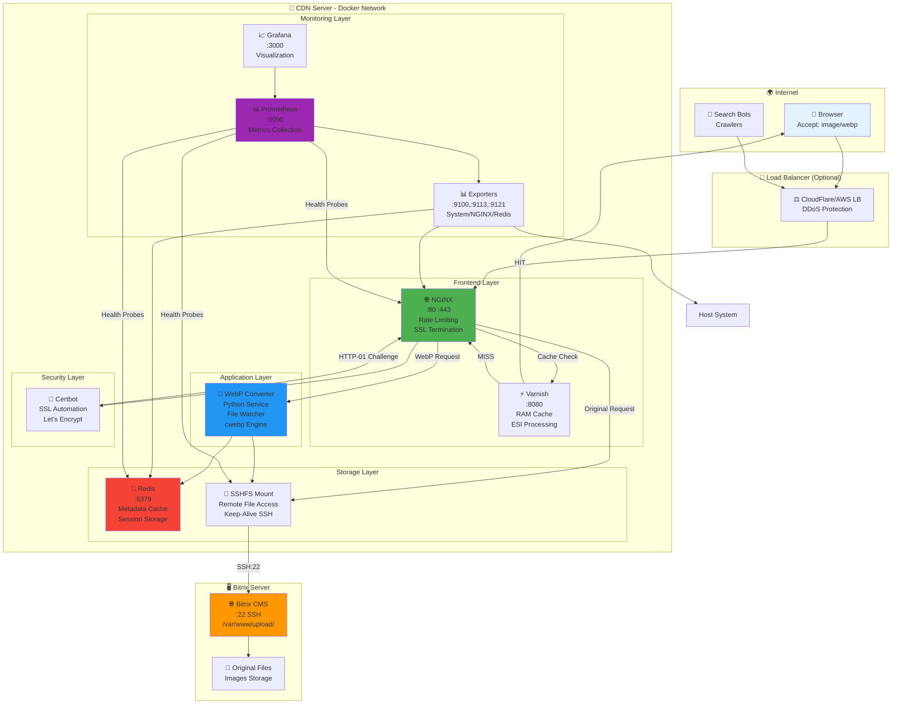
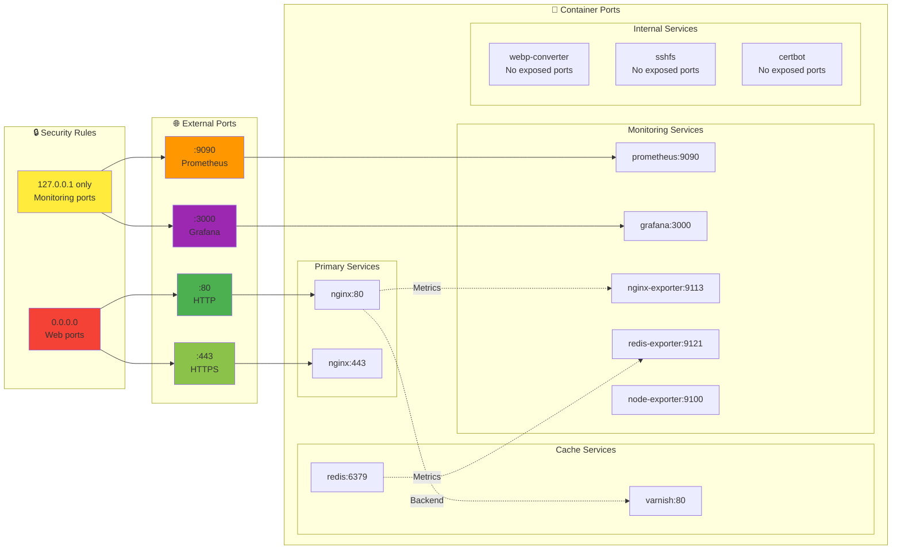
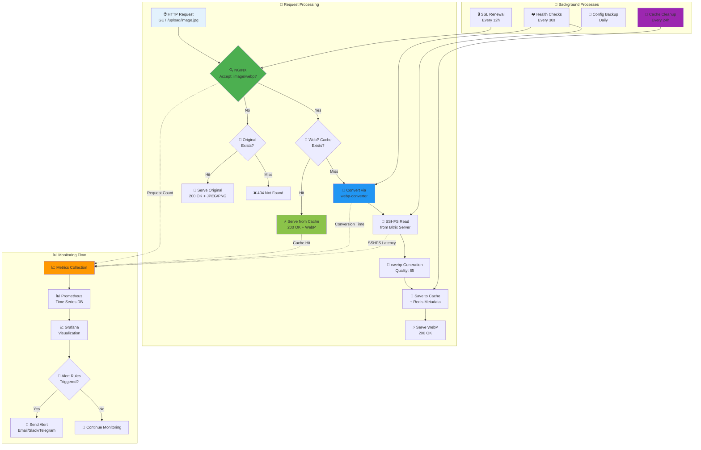
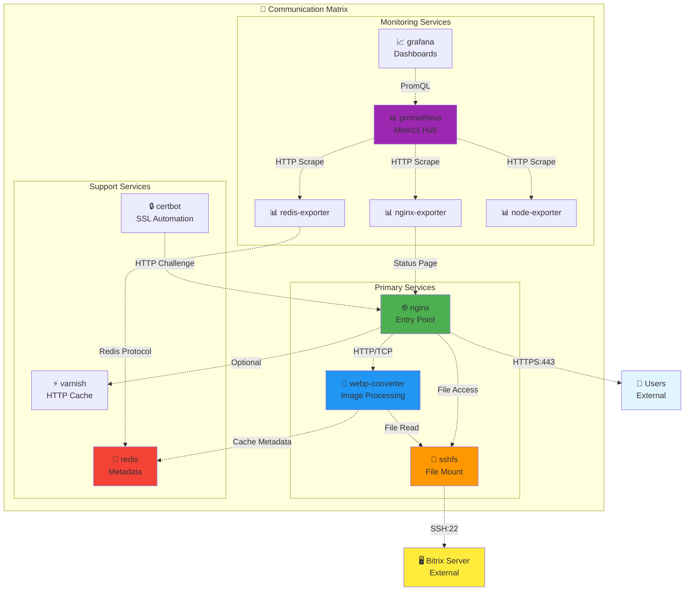

# 🌐 Сетевые потоки и взаимодействие контейнеров

**Автор**: Chibilyaev Alexandr | **AAChibilyaev LTD** | info@aachibilyaev.com

## 🔀 Схема сетевого взаимодействия

## 🔌 Port Mapping & Service Discovery

## 📊 Data Flow Between Containers

## 🔗 Inter-Container Communication

