# 🎛️ Операционное управление Bitrix CDN

**Автор**: Chibilyaev Alexandr | **AAChibilyaev LTD** | info@aachibilyaev.com

## 🚀 Operational Dashboard & Control Center

```mermaid
graph TB
    subgraph "🎛️ Control Center Interface"
        subgraph "Real-time Status"
            STATUS_OVERVIEW[📊 System Overview<br/>Service health: 🟢 All OK<br/>Active requests: 47/sec<br/>Cache hit ratio: 87.3%<br/>Disk usage: 34.2GB/100GB]
            
            SERVICE_STATUS[🔧 Service Status<br/>🟢 nginx: Healthy (2 replicas)<br/>🟢 converter: Healthy (1 replica)<br/>🟢 redis: Healthy<br/>🟢 sshfs: Connected<br/>🟢 monitoring: Active]
            
            ALERT_CENTER[🚨 Alert Center<br/>🟡 1 Warning: Cache size growing<br/>🔴 0 Critical alerts<br/>📊 24h alert summary<br/>🔄 Last check: 15s ago]
        end
        
        subgraph "Quick Actions"
            QUICK_RESTART[🔄 Quick Restart<br/>Restart service<br/>Rolling restart<br/>Emergency restart<br/>Full system restart]
            
            CACHE_CONTROL[🗂️ Cache Control<br/>Clear cache<br/>Warm cache<br/>View cache stats<br/>Manual cleanup]
            
            SCALING_CONTROL[📈 Scaling Control<br/>Scale up/down<br/>Auto-scaling toggle<br/>Resource limits<br/>Performance mode]
        end
        
        subgraph "Configuration Management"
            CONFIG_EDITOR[⚙️ Config Editor<br/>Live config editing<br/>Syntax validation<br/>Change preview<br/>Rollback capability]
            
            SECRET_MANAGER[🔑 Secret Manager<br/>SSH key rotation<br/>SSL certificate renewal<br/>API key updates<br/>Access control]
            
            BACKUP_RESTORE[💾 Backup & Restore<br/>Create backup<br/>Restore from backup<br/>Scheduled backups<br/>Version management]
        end
    end
    
    subgraph "📊 Operational Workflows"
        subgraph "Daily Operations"
            HEALTH_CHECK[❤️ Health Check Routine<br/>Service availability<br/>Performance metrics<br/>Resource usage<br/>Security status]
            
            LOG_REVIEW[📋 Log Review<br/>Error log analysis<br/>Access pattern review<br/>Security event check<br/>Performance trends]
            
            CAPACITY_REVIEW[📊 Capacity Review<br/>Resource utilization<br/>Growth projections<br/>Scaling decisions<br/>Cost optimization]
        end
        
        subgraph "Weekly Operations"
            PERFORMANCE_ANALYSIS[📈 Performance Analysis<br/>Baseline comparison<br/>Trend analysis<br/>Bottleneck identification<br/>Optimization opportunities]
            
            SECURITY_AUDIT[🔒 Security Audit<br/>Access log review<br/>Vulnerability scan<br/>Configuration review<br/>Compliance check]
            
            BACKUP_VALIDATION[✅ Backup Validation<br/>Backup integrity<br/>Restore testing<br/>Recovery procedures<br/>Data consistency]
        end
        
        subgraph "Monthly Operations"
            ARCHITECTURE_REVIEW[🏗️ Architecture Review<br/>Design validation<br/>Scalability assessment<br/>Technology updates<br/>Best practice review]
            
            COST_OPTIMIZATION[💰 Cost Optimization<br/>Resource efficiency<br/>Scaling strategy<br/>Service optimization<br/>Budget planning]
            
            DISASTER_PLANNING[🆘 Disaster Planning<br/>Recovery procedures<br/>Business continuity<br/>Risk assessment<br/>Plan updates]
        end
    end
    
    subgraph "🔧 Maintenance Procedures"
        subgraph "Scheduled Maintenance"
            SYSTEM_UPDATES[🔄 System Updates<br/>OS security patches<br/>Docker image updates<br/>Dependency updates<br/>Configuration updates]
            
            CERTIFICATE_RENEWAL[🔐 Certificate Management<br/>SSL cert renewal<br/>Certificate validation<br/>Chain verification<br/>Automated deployment]
            
            CACHE_OPTIMIZATION[🗂️ Cache Optimization<br/>Cache warming<br/>Eviction tuning<br/>Performance analysis<br/>Storage optimization]
        end
        
        subgraph "Emergency Procedures"
            INCIDENT_RESPONSE[🚨 Incident Response<br/>Problem identification<br/>Impact assessment<br/>Immediate mitigation<br/>Root cause analysis]
            
            SERVICE_RECOVERY[🔄 Service Recovery<br/>Service restart<br/>Data recovery<br/>Configuration restore<br/>Performance validation]
            
            ESCALATION_PROCESS[📞 Escalation Process<br/>Alert escalation<br/>Team notification<br/>Management reporting<br/>External support]
        end
    end
    
    %% Status flow
    STATUS_OVERVIEW --> HEALTH_CHECK
    SERVICE_STATUS --> LOG_REVIEW
    ALERT_CENTER --> CAPACITY_REVIEW
    
    %% Quick actions flow
    QUICK_RESTART --> SYSTEM_UPDATES
    CACHE_CONTROL --> CACHE_OPTIMIZATION
    SCALING_CONTROL --> PERFORMANCE_ANALYSIS
    
    %% Configuration flow
    CONFIG_EDITOR --> SECURITY_AUDIT
    SECRET_MANAGER --> CERTIFICATE_RENEWAL
    BACKUP_RESTORE --> BACKUP_VALIDATION
    
    %% Analysis to planning
    PERFORMANCE_ANALYSIS --> ARCHITECTURE_REVIEW
    SECURITY_AUDIT --> COST_OPTIMIZATION
    BACKUP_VALIDATION --> DISASTER_PLANNING
    
    %% Emergency flow
    ALERT_CENTER --> INCIDENT_RESPONSE
    INCIDENT_RESPONSE --> SERVICE_RECOVERY
    SERVICE_RECOVERY --> ESCALATION_PROCESS

    style STATUS_OVERVIEW fill:#4caf50
    style QUICK_RESTART fill:#2196f3
    style INCIDENT_RESPONSE fill:#f44336
    style PERFORMANCE_ANALYSIS fill:#ff9800
    style ARCHITECTURE_REVIEW fill:#9c27b0
```

## 📋 Operational Runbooks

```mermaid
flowchart TD
    subgraph "📚 Standard Operating Procedures"
        subgraph "🚨 Incident Response Runbook"
            INCIDENT_DETECT[🔍 Incident Detection<br/>Alert received<br/>User report<br/>Monitoring alarm<br/>Performance degradation]
            
            INCIDENT_CLASSIFY[📊 Classification<br/>Severity: P1-P4<br/>Impact assessment<br/>Urgency evaluation<br/>Resource allocation]
            
            INCIDENT_MITIGATE[🛠️ Immediate Mitigation<br/>Service restart<br/>Traffic reroute<br/>Emergency scaling<br/>Rollback deployment]
            
            INCIDENT_RESOLVE[✅ Resolution<br/>Root cause fix<br/>System validation<br/>Performance check<br/>Documentation update]
        end
        
        subgraph "🔄 Maintenance Runbook"
            MAINTENANCE_PLAN[📋 Maintenance Planning<br/>Change window<br/>Impact assessment<br/>Rollback plan<br/>Communication plan]
            
            MAINTENANCE_PREP[🎯 Preparation<br/>Backup creation<br/>Resource staging<br/>Team coordination<br/>Monitoring setup]
            
            MAINTENANCE_EXEC[🚀 Execution<br/>Change implementation<br/>Progress monitoring<br/>Validation testing<br/>Performance check]
            
            MAINTENANCE_CLOSE[🏁 Closure<br/>Change validation<br/>Monitoring normalization<br/>Documentation update<br/>Lessons learned]
        end
        
        subgraph "📊 Performance Runbook"
            PERF_BASELINE[📈 Baseline Review<br/>Performance metrics<br/>Historical trends<br/>Capacity planning<br/>Threshold validation]
            
            PERF_ANALYSIS[🔬 Performance Analysis<br/>Bottleneck identification<br/>Resource utilization<br/>Optimization opportunities<br/>Impact assessment]
            
            PERF_OPTIMIZE[🔧 Optimization<br/>Configuration tuning<br/>Resource scaling<br/>Code optimization<br/>Infrastructure upgrade]
            
            PERF_VALIDATE[✅ Validation<br/>Performance testing<br/>Baseline comparison<br/>SLA compliance<br/>User experience check]
        end
    end
    
    subgraph "🎯 Operational Automation"
        subgraph "Self-Healing Systems"
            AUTO_RESTART[🔄 Auto-restart<br/>Service failure detection<br/>Automatic restart<br/>Health verification<br/>Escalation if failed]
            
            AUTO_SCALE[📈 Auto-scaling<br/>Load-based scaling<br/>Predictive scaling<br/>Resource optimization<br/>Cost awareness]
            
            AUTO_RECOVERY[🏥 Auto-recovery<br/>Configuration drift<br/>Service degradation<br/>Data corruption<br/>Network issues]
        end
        
        subgraph "Proactive Maintenance"
            PREDICTIVE_ALERTS[🔮 Predictive Alerts<br/>Trend analysis<br/>Anomaly detection<br/>Capacity forecasting<br/>Preventive actions]
            
            AUTOMATED_UPDATES[🔄 Automated Updates<br/>Security patches<br/>Minor updates<br/>Configuration sync<br/>Certificate renewal]
            
            INTELLIGENT_CLEANUP[🧹 Intelligent Cleanup<br/>Cache optimization<br/>Log rotation<br/>Temporary file cleanup<br/>Resource recycling]
        end
    end
    
    subgraph "📞 Communication & Escalation"
        NOTIFICATION_MATRIX[📧 Notification Matrix<br/>Severity-based routing<br/>Team escalation<br/>Management reporting<br/>Customer communication]
        
        ESCALATION_TREE[🌳 Escalation Tree<br/>L1: Ops team (0-15min)<br/>L2: DevOps lead (15-30min)<br/>L3: Architecture team (30-60min)<br/>L4: Management (60min+)]
        
        COMMUNICATION_PLAN[📢 Communication Plan<br/>Status page updates<br/>Customer notifications<br/>Internal updates<br/>Post-incident reports]
    end
    
    %% Incident flow
    INCIDENT_DETECT --> INCIDENT_CLASSIFY
    INCIDENT_CLASSIFY --> INCIDENT_MITIGATE
    INCIDENT_MITIGATE --> INCIDENT_RESOLVE
    
    %% Maintenance flow
    MAINTENANCE_PLAN --> MAINTENANCE_PREP
    MAINTENANCE_PREP --> MAINTENANCE_EXEC
    MAINTENANCE_EXEC --> MAINTENANCE_CLOSE
    
    %% Performance flow
    PERF_BASELINE --> PERF_ANALYSIS
    PERF_ANALYSIS --> PERF_OPTIMIZE
    PERF_OPTIMIZE --> PERF_VALIDATE
    
    %% Automation integration
    INCIDENT_DETECT --> AUTO_RESTART
    PERF_ANALYSIS --> AUTO_SCALE
    MAINTENANCE_EXEC --> AUTO_RECOVERY
    
    PERF_VALIDATE --> PREDICTIVE_ALERTS
    AUTO_RECOVERY --> AUTOMATED_UPDATES
    AUTO_RESTART --> INTELLIGENT_CLEANUP
    
    %% Communication flow
    INCIDENT_CLASSIFY --> NOTIFICATION_MATRIX
    NOTIFICATION_MATRIX --> ESCALATION_TREE
    ESCALATION_TREE --> COMMUNICATION_PLAN

    style INCIDENT_DETECT fill:#f44336
    style AUTO_RESTART fill:#4caf50
    style PERF_OPTIMIZE fill:#2196f3
    style PREDICTIVE_ALERTS fill:#ff9800
    style ESCALATION_TREE fill:#9c27b0
```

## 🎪 Operational Metrics & KPIs

```mermaid
graph LR
    subgraph "📊 Operational KPI Dashboard"
        subgraph "Service Level Metrics"
            AVAILABILITY[🌟 Service Availability<br/>Current: 99.97%<br/>Target: 99.9%<br/>Monthly uptime tracking]
            
            PERFORMANCE[⚡ Performance Index<br/>Current: 8.7/10<br/>Response time weighted<br/>User satisfaction score]
            
            RELIABILITY[🛡️ Reliability Score<br/>Current: 9.2/10<br/>MTBF: 720 hours<br/>MTTR: 4.3 minutes]
            
            QUALITY[✨ Service Quality<br/>Current: 9.1/10<br/>Error rate weighted<br/>Feature completeness]
        end
        
        subgraph "Business Impact Metrics"
            COST_EFFICIENCY[💰 Cost Efficiency<br/>Current: $0.02/GB served<br/>23% below budget<br/>ROI: 340%]
            
            BANDWIDTH_SAVINGS[📈 Bandwidth Savings<br/>Current: 52.3% average<br/>WebP optimization<br/>$1,200/month saved]
            
            USER_EXPERIENCE[👤 User Experience<br/>Page load: -1.2s average<br/>Bounce rate: -15%<br/>SEO score: +18%]
            
            SCALABILITY[📊 Scalability Index<br/>Current load: 45%<br/>Scaling headroom: 55%<br/>Growth capacity: 220%]
        end
        
        subgraph "Technical Health Metrics"
            INFRASTRUCTURE[🏗️ Infrastructure Health<br/>Container health: 100%<br/>Network latency: 12ms<br/>Storage performance: 95%]
            
            SECURITY[🔒 Security Posture<br/>Vulnerability score: 0<br/>Compliance: 100%<br/>Threat detection: Active]
            
            MAINTENANCE[🔧 Maintenance Index<br/>Planned maintenance: 99.2%<br/>Emergency fixes: 0.8%<br/>Technical debt: Low]
        end
    end
    
    subgraph "🎯 Operational Excellence Framework"
        subgraph "Process Maturity"
            AUTOMATION[🤖 Automation Level<br/>Deployment: 95%<br/>Monitoring: 98%<br/>Recovery: 85%<br/>Maintenance: 90%]
            
            DOCUMENTATION[📚 Documentation Quality<br/>Coverage: 92%<br/>Accuracy: 96%<br/>Accessibility: 94%<br/>Maintenance: Current]
            
            TRAINING[🎓 Team Readiness<br/>Skill coverage: 95%<br/>Runbook familiarity: 98%<br/>Tool proficiency: 92%<br/>Response time: 3.2min]
        end
        
        subgraph "Continuous Improvement"
            FEEDBACK_LOOPS[🔄 Feedback Integration<br/>User feedback: Weekly<br/>Performance data: Real-time<br/>Team retrospectives: Bi-weekly<br/>Business alignment: Monthly]
            
            INNOVATION[💡 Innovation Index<br/>Technology adoption: Advanced<br/>Best practice implementation: 94%<br/>R&D investment: 12%<br/>Feature evolution: Active]
            
            LEARNING[📖 Learning Culture<br/>Knowledge sharing: Active<br/>Cross-training: 85%<br/>External training: 40h/quarter<br/>Certification: Current]
        end
    end
    
    subgraph "🔄 Operational Lifecycle"
        PLAN[📋 Planning Phase<br/>Capacity planning<br/>Change management<br/>Resource allocation<br/>Risk assessment]
        
        DEPLOY[🚀 Deployment Phase<br/>Change implementation<br/>Validation testing<br/>Rollback readiness<br/>Communication]
        
        OPERATE[🎛️ Operations Phase<br/>Service monitoring<br/>Performance management<br/>Issue resolution<br/>User support]
        
        OPTIMIZE[🔧 Optimization Phase<br/>Performance tuning<br/>Cost optimization<br/>Process improvement<br/>Technology updates]
        
        REVIEW[🔍 Review Phase<br/>Performance review<br/>Lessons learned<br/>Process refinement<br/>Strategic planning]
    end
    
    %% KPI relationships
    AVAILABILITY --> RELIABILITY
    PERFORMANCE --> QUALITY
    COST_EFFICIENCY --> BANDWIDTH_SAVINGS
    USER_EXPERIENCE --> SCALABILITY
    
    %% Excellence framework
    INFRASTRUCTURE --> AUTOMATION
    SECURITY --> DOCUMENTATION
    MAINTENANCE --> TRAINING
    
    AUTOMATION --> FEEDBACK_LOOPS
    DOCUMENTATION --> INNOVATION
    TRAINING --> LEARNING
    
    %% Lifecycle flow
    PLAN --> DEPLOY
    DEPLOY --> OPERATE
    OPERATE --> OPTIMIZE
    OPTIMIZE --> REVIEW
    REVIEW --> PLAN
    
    %% Integration points
    QUALITY --> OPERATE
    SCALABILITY --> OPTIMIZE
    LEARNING --> REVIEW

    style AVAILABILITY fill:#4caf50
    style COST_EFFICIENCY fill:#2196f3
    style AUTOMATION fill:#ff9800
    style OPERATE fill:#9c27b0
    style REVIEW fill:#8bc34a
```



## 🎛️ Command & Control Interface

```mermaid
graph TB
    subgraph "🖥️ Management Interface"
        subgraph "Web-based Control Panel"
            DASHBOARD[📊 Main Dashboard<br/>Grafana + Custom UI<br/>Real-time metrics<br/>Interactive controls]
            
            SERVICE_CONTROL[🎛️ Service Control<br/>Start/stop services<br/>Configuration updates<br/>Log viewing<br/>Health checks]
            
            CACHE_MANAGEMENT[🗂️ Cache Management<br/>Cache statistics<br/>Manual cleanup<br/>Cache warming<br/>Storage analytics]
            
            ALERT_MANAGEMENT[🚨 Alert Management<br/>Active alerts<br/>Alert history<br/>Silence management<br/>Escalation control]
        end
        
        subgraph "CLI Management Tools"
            DOCKER_MANAGE[🐳 Docker Management<br/>./docker-manage.sh<br/>Container orchestration<br/>Service lifecycle<br/>Troubleshooting]
            
            WEBP_TOOLS[🎨 WebP Tools<br/>./webp-convert.sh<br/>Manual conversion<br/>Batch processing<br/>Statistics]
            
            MONITORING_CLI[📊 Monitoring CLI<br/>Real-time stats<br/>Log aggregation<br/>Performance analysis<br/>Debug tools]
        end
        
        subgraph "API Endpoints"
            REST_API[🌐 REST API<br/>Service control<br/>Configuration updates<br/>Status queries<br/>Performance data]
            
            WEBHOOK_API[🔗 Webhook API<br/>Event notifications<br/>Integration hooks<br/>Alert forwarding<br/>Status updates]
            
            METRICS_API[📊 Metrics API<br/>Prometheus endpoints<br/>Custom metrics<br/>Real-time data<br/>Historical queries]
        end
    end
    
    subgraph "🔧 Operational Commands"
        subgraph "Service Management"
            START_SERVICES[🚀 Start Services<br/>docker-compose up -d<br/>Health check wait<br/>Service validation<br/>Load balancer update]
            
            STOP_SERVICES[⛔ Stop Services<br/>Graceful shutdown<br/>Data persistence<br/>Connection draining<br/>Clean termination]
            
            RESTART_SERVICES[🔄 Restart Services<br/>Rolling restart<br/>Zero-downtime<br/>Health validation<br/>Performance check]
            
            SCALE_SERVICES[📈 Scale Services<br/>Horizontal scaling<br/>Resource adjustment<br/>Load redistribution<br/>Performance validation]
        end
        
        subgraph "Data Management"
            BACKUP_DATA[💾 Backup Operations<br/>Configuration backup<br/>Volume snapshots<br/>Metadata export<br/>Recovery testing]
            
            RESTORE_DATA[🔄 Restore Operations<br/>Point-in-time recovery<br/>Service restoration<br/>Data validation<br/>System verification]
            
            MIGRATE_DATA[📦 Data Migration<br/>Version upgrades<br/>Platform migration<br/>Data transformation<br/>Validation testing]
        end
        
        subgraph "Maintenance Operations"
            UPDATE_SYSTEM[🔄 System Updates<br/>OS patches<br/>Docker updates<br/>Application updates<br/>Configuration updates]
            
            SECURITY_AUDIT[🔒 Security Operations<br/>Vulnerability scanning<br/>Access review<br/>Certificate management<br/>Compliance check]
            
            PERFORMANCE_TUNE[⚡ Performance Tuning<br/>Parameter optimization<br/>Resource allocation<br/>Cache tuning<br/>Network optimization]
        end
    end
    
    subgraph "📊 Operational Intelligence"
        PREDICTIVE_OPS[🔮 Predictive Operations<br/>Failure prediction<br/>Capacity forecasting<br/>Maintenance scheduling<br/>Risk assessment]
        
        AUTONOMOUS_OPS[🤖 Autonomous Operations<br/>Self-healing systems<br/>Auto-optimization<br/>Intelligent scaling<br/>Adaptive configuration]
        
        COGNITIVE_OPS[🧠 Cognitive Operations<br/>Pattern recognition<br/>Anomaly detection<br/>Root cause analysis<br/>Decision support]
    end
    
    %% Interface to commands
    DASHBOARD --> START_SERVICES
    SERVICE_CONTROL --> RESTART_SERVICES
    CACHE_MANAGEMENT --> BACKUP_DATA
    ALERT_MANAGEMENT --> SCALE_SERVICES
    
    DOCKER_MANAGE --> UPDATE_SYSTEM
    WEBP_TOOLS --> PERFORMANCE_TUNE
    MONITORING_CLI --> SECURITY_AUDIT
    
    REST_API --> MIGRATE_DATA
    WEBHOOK_API --> RESTORE_DATA
    
    %% Commands to intelligence
    SCALE_SERVICES --> PREDICTIVE_OPS
    PERFORMANCE_TUNE --> AUTONOMOUS_OPS
    SECURITY_AUDIT --> COGNITIVE_OPS
    
    %% Intelligence feedback
    PREDICTIVE_OPS --> START_SERVICES
    AUTONOMOUS_OPS --> RESTART_SERVICES
    COGNITIVE_OPS --> PERFORMANCE_TUNE

    style DASHBOARD fill:#4caf50
    style START_SERVICES fill:#2196f3
    style PREDICTIVE_OPS fill:#ff9800
    style AUTONOMOUS_OPS fill:#9c27b0
    style BACKUP_DATA fill:#8bc34a
```



## 🎪 Change Management Process


## 🎯 Service Level Management

