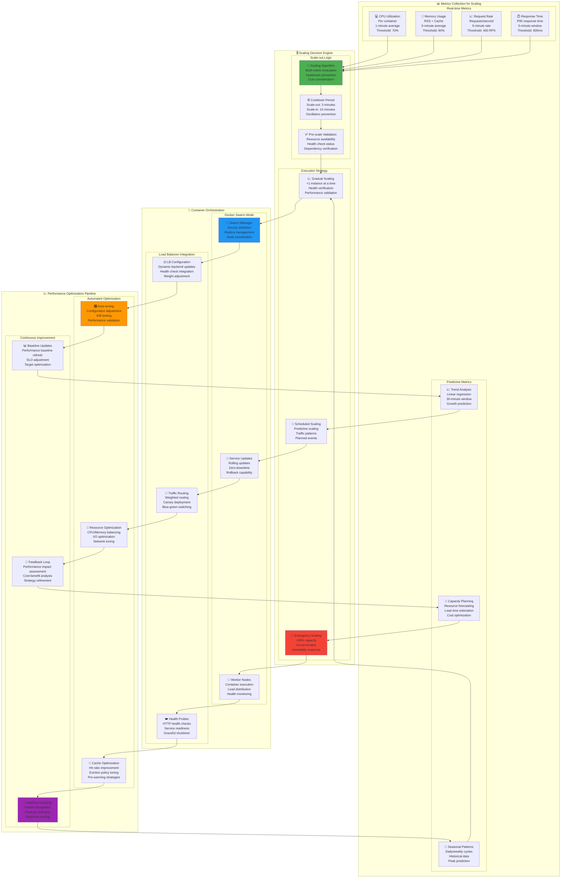
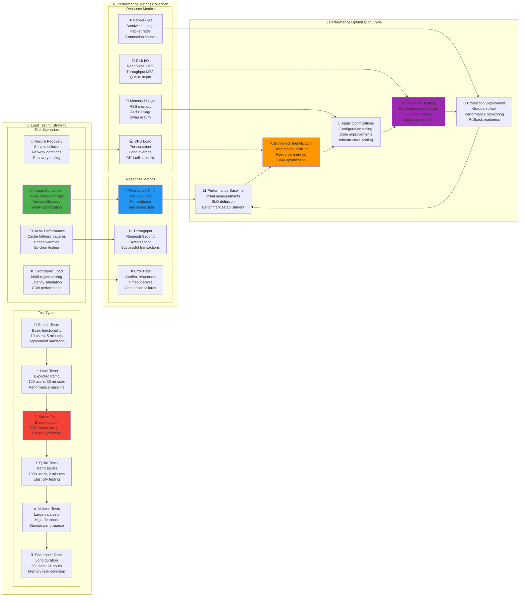

# ⚡ Производительность и масштабирование Bitrix CDN

**Автор**: Chibilyaev Alexandr | **AAChibilyaev LTD** | info@aachibilyaev.com

## 🎯 Performance Benchmarks & SLA

```mermaid
graph TB
    subgraph "🎯 Service Level Objectives (SLO)"
        subgraph "Response Time SLO"
            RT_STATIC[⚡ Static Files<br/>P95: < 50ms<br/>P99: < 100ms<br/>Target: 99.9% within SLO]
            
            RT_WEBP[🎨 WebP Conversion<br/>P95: < 500ms<br/>P99: < 1000ms<br/>Target: 99% within SLO]
            
            RT_CACHE[💾 Cache Hits<br/>P95: < 10ms<br/>P99: < 20ms<br/>Target: 99.95% within SLO]
        end
        
        subgraph "Availability SLO"
            UPTIME[🌟 Service Availability<br/>Target: 99.9% (8.76h/year)<br/>Measured: 4-week rolling<br/>Excludes maintenance]
            
            ERROR_BUDGET[📊 Error Budget<br/>0.1% of requests<br/>~43,200 errors/month<br/>Budget tracking]
        end
        
        subgraph "Throughput SLO"
            RPS[📈 Requests/Second<br/>Peak: 1000 RPS<br/>Sustained: 500 RPS<br/>Burst: 2000 RPS (30s)]
            
            CONCURRENT[🔗 Concurrent Users<br/>Peak: 10,000 users<br/>Active: 1,000 users<br/>Session: 100,000 users/day]
        end
    end
    
    subgraph "📊 Current Performance Baseline"
        subgraph "Measured Performance"
            CURRENT_RT[⏱️ Current Response Times<br/>Static: 15ms (P95)<br/>WebP: 280ms (P95)<br/>Cache: 3ms (P95)]
            
            CURRENT_RPS[📈 Current Throughput<br/>Average: 150 RPS<br/>Peak: 450 RPS<br/>Growth: +15%/month]
            
            CURRENT_ERRORS[❌ Current Error Rate<br/>Overall: 0.03%<br/>4xx: 0.02%<br/>5xx: 0.01%]
        end
        
        subgraph "Resource Utilization"
            CPU_UTIL[💻 CPU Usage<br/>Average: 35%<br/>Peak: 65%<br/>Headroom: 35%]
            
            MEM_UTIL[💾 Memory Usage<br/>Average: 45%<br/>Peak: 72%<br/>Headroom: 28%]
            
            DISK_UTIL[💽 Disk I/O<br/>Read: 25MB/s avg<br/>Write: 15MB/s avg<br/>IOPS: ~500/s]
        end
    end
    
    subgraph "🚀 Scaling Strategy"
        subgraph "Horizontal Scaling Triggers"
            H_CPU[💻 CPU Trigger<br/>Sustained >70% for 5min<br/>Scale out +1 instance<br/>Max: 5 instances]
            
            H_MEMORY[💾 Memory Trigger<br/>Sustained >80% for 3min<br/>Scale out +1 instance<br/>Check memory leaks]
            
            H_RPS[📈 RPS Trigger<br/>Sustained >400 RPS<br/>Scale out nginx+converter<br/>Load balancer update]
        end
        
        subgraph "Vertical Scaling Options"
            V_CPU[💻 CPU Scaling<br/>2 → 4 → 6 cores<br/>Linear performance<br/>Container limits update]
            
            V_MEMORY[💾 Memory Scaling<br/>2GB → 4GB → 8GB<br/>Cache size increase<br/>Buffer optimization]
            
            V_STORAGE[💽 Storage Scaling<br/>SSD performance tier<br/>RAID configuration<br/>Cache volume expansion]
        end
    end
    
    %% Performance relationships
    RT_STATIC --> CURRENT_RT
    RT_WEBP --> CURRENT_RPS
    RT_CACHE --> CURRENT_ERRORS
    
    CURRENT_RT --> CPU_UTIL
    CURRENT_RPS --> MEM_UTIL
    CURRENT_ERRORS --> DISK_UTIL
    
    CPU_UTIL --> H_CPU
    MEM_UTIL --> H_MEMORY
    DISK_UTIL --> H_RPS
    
    H_CPU --> V_CPU
    H_MEMORY --> V_MEMORY
    H_RPS --> V_STORAGE

    style RT_WEBP fill:#4caf50
    style CURRENT_RT fill:#2196f3
    style H_CPU fill:#ff9800
    style V_CPU fill:#9c27b0
    style UPTIME fill:#8bc34a
```

## 🏗️ Auto-scaling Architecture



## 🎪 Multi-region Scaling Model

```mermaid
graph TB
    subgraph "🌍 Global CDN Architecture"
        subgraph "Primary Region (Europe)"
            EU_PRIMARY[🇪🇺 EU-Central<br/>Frankfurt, Germany<br/>Primary CDN node<br/>Full WebP conversion]
            
            EU_CACHE[💾 EU Cache Cluster<br/>Redis Cluster: 3 nodes<br/>WebP Cache: 200GB<br/>99.9% availability]
            
            EU_MONITOR[📊 EU Monitoring<br/>Regional Prometheus<br/>Local alerting<br/>Grafana federation]
        end
        
        subgraph "Secondary Regions"
            US_SECONDARY[🇺🇸 US-East<br/>Virginia, USA<br/>Cache-only node<br/>Fallback conversion]
            
            ASIA_SECONDARY[🇸🇬 Asia-Pacific<br/>Singapore<br/>Cache-only node<br/>Regional optimization]
            
            RU_SECONDARY[🇷🇺 Russia<br/>Moscow<br/>Full CDN node<br/>Local compliance]
        end
        
        subgraph "Edge Locations"
            EDGE_TIER[🌐 Edge Cache Tier<br/>CloudFlare/AWS<br/>150+ locations<br/>Static asset only]
        end
    end
    
    subgraph "⚖️ Load Distribution Strategy"
        subgraph "Geographic Routing"
            DNS_GEO[🌍 GeoDNS Routing<br/>Latency-based<br/>Failover rules<br/>Health awareness]
            
            REGIONAL_LB[⚖️ Regional Load Balancer<br/>Round-robin<br/>Least connections<br/>Health checks]
            
            LOCAL_LB[🎯 Local Load Balancer<br/>NGINX upstream<br/>Weighted distribution<br/>Session affinity]
        end
        
        subgraph "Traffic Management"
            TRAFFIC_SPLIT[📊 Traffic Splitting<br/>90% primary region<br/>10% testing/canary<br/>Gradual migration]
            
            FAILOVER[🔄 Automatic Failover<br/>Health-based routing<br/>30s detection time<br/>Graceful degradation]
            
            CAPACITY_LIMIT[📏 Capacity Management<br/>Rate limiting per region<br/>Queue management<br/>Overflow routing]
        end
    end
    
    subgraph "📈 Scaling Dimensions"
        subgraph "Horizontal Scaling"
            H_NGINX[🌐 NGINX Scaling<br/>Min: 2 replicas<br/>Max: 10 replicas<br/>CPU threshold: 70%]
            
            H_CONVERTER[🎨 Converter Scaling<br/>Min: 1 replica<br/>Max: 5 replicas<br/>Queue threshold: 10 items]
            
            H_REDIS[🔴 Redis Clustering<br/>3-node cluster<br/>Sharding strategy<br/>Consistent hashing]
        end
        
        subgraph "Vertical Scaling"
            V_CPU[💻 CPU Scaling<br/>2 → 4 → 8 cores<br/>Linear scaling<br/>NUMA awareness]
            
            V_MEMORY[💾 Memory Scaling<br/>2GB → 4GB → 8GB<br/>Cache optimization<br/>Buffer tuning]
            
            V_STORAGE[💽 Storage Scaling<br/>NVMe SSD tiers<br/>Cache partitioning<br/>I/O optimization]
        end
        
        subgraph "Network Scaling"
            BANDWIDTH[🌐 Bandwidth Scaling<br/>1Gbps → 10Gbps<br/>Multiple interfaces<br/>Traffic shaping]
            
            CONNECTIONS[🔗 Connection Scaling<br/>Connection pooling<br/>Keep-alive optimization<br/>Multiplexing]
        end
    end
    
    subgraph "🧠 Intelligent Scaling"
        PREDICTIVE[🔮 Predictive Scaling<br/>ML-based forecasting<br/>Traffic pattern analysis<br/>Proactive scaling]
        
        REACTIVE[⚡ Reactive Scaling<br/>Real-time metrics<br/>Threshold-based<br/>Fast response (<2min)]
        
        SCHEDULED[📅 Scheduled Scaling<br/>Known traffic patterns<br/>Business events<br/>Maintenance windows]
        
        COST_AWARE[💰 Cost-aware Scaling<br/>Resource cost optimization<br/>Spot instance usage<br/>Off-peak scaling down]
    end
    
    %% Regional connections
    EU_PRIMARY --> US_SECONDARY
    EU_PRIMARY --> ASIA_SECONDARY
    EU_PRIMARY --> RU_SECONDARY
    
    EU_CACHE --> EU_MONITOR
    US_SECONDARY --> EU_CACHE
    
    %% Traffic flow
    DNS_GEO --> REGIONAL_LB
    REGIONAL_LB --> LOCAL_LB
    LOCAL_LB --> H_NGINX
    
    TRAFFIC_SPLIT --> FAILOVER
    FAILOVER --> CAPACITY_LIMIT
    
    %% Scaling triggers
    H_NGINX --> V_CPU
    H_CONVERTER --> V_MEMORY
    H_REDIS --> V_STORAGE
    
    V_CPU --> BANDWIDTH
    V_MEMORY --> CONNECTIONS
    
    %% Intelligence
    BANDWIDTH --> PREDICTIVE
    CONNECTIONS --> REACTIVE
    PREDICTIVE --> SCHEDULED
    REACTIVE --> COST_AWARE

    style EU_PRIMARY fill:#4caf50
    style H_NGINX fill:#2196f3
    style PREDICTIVE fill:#ff9800
    style COST_AWARE fill:#9c27b0
    style RT_WEBP fill:#8bc34a
```

## 🔄 Auto-scaling Implementation

```mermaid
stateDiagram-v2
    [*] --> Monitoring: Start monitoring
    
    state Monitoring {
        [*] --> CollectMetrics: Every 30 seconds
        CollectMetrics --> EvaluateThresholds: Check scaling rules
        EvaluateThresholds --> [*]: Within limits
    }
    
    Monitoring --> ScaleDecision: Threshold exceeded
    
    state ScaleDecision {
        [*] --> AnalyzeMetrics: Multi-dimensional analysis
        AnalyzeMetrics --> CheckCooldown: Evaluate scaling need
        CheckCooldown --> InCooldown: Recent scaling event
        CheckCooldown --> ReadyToScale: Cooldown expired
        
        InCooldown --> [*]: Wait for cooldown
        ReadyToScale --> DetermineAction: Calculate scale factor
        
        state DetermineAction {
            [*] --> ScaleOut: Increase capacity
            [*] --> ScaleIn: Decrease capacity
            [*] --> ScaleUp: Vertical scaling
            [*] --> NoAction: Within acceptable range
        }
        
        DetermineAction --> [*]
    }
    
    ScaleDecision --> ScaleExecution: Action determined
    
    state ScaleExecution {
        [*] --> PreScaleChecks: Validate prerequisites
        PreScaleChecks --> ResourceCheck: Check available resources
        ResourceCheck --> InsufficientResources: Not enough capacity
        ResourceCheck --> ExecuteScaling: Resources available
        
        InsufficientResources --> [*]: Scaling blocked
        
        state ExecuteScaling {
            [*] --> UpdateService: Modify service config
            UpdateService --> DeployInstances: Start new containers
            DeployInstances --> HealthCheck: Wait for readiness
            HealthCheck --> UpdateLB: Update load balancer
            UpdateLB --> VerifyScaling: Validate scaling success
            VerifyScaling --> [*]: Scaling complete
        }
        
        ExecuteScaling --> [*]
    }
    
    ScaleExecution --> PostScale: Scaling complete
    
    state PostScale {
        [*] --> ValidatePerformance: Check performance impact
        ValidatePerformance --> PerformanceGood: SLO maintained
        ValidatePerformance --> PerformancePoor: SLO degraded
        
        PerformanceGood --> UpdateBaseline: Update performance baseline
        PerformancePoor --> InitiateRollback: Rollback scaling
        
        UpdateBaseline --> [*]
        
        state InitiateRollback {
            [*] --> RollbackService: Revert service config
            RollbackService --> RemoveInstances: Stop excess containers
            RemoveInstances --> RestoreLB: Restore LB config
            RestoreLB --> [*]: Rollback complete
        }
        
        InitiateRollback --> [*]
    }
    
    PostScale --> Monitoring: Continue monitoring
```



## 🎪 Performance Testing Framework



## 🎛️ Resource Optimization Matrix

```mermaid
graph TB
    subgraph "🎯 Optimization Targets by Service"
        subgraph "🌐 NGINX Optimization"
            NG1[⚡ Worker Configuration<br/>worker_processes: auto<br/>worker_connections: 2048<br/>worker_rlimit_nofile: 65536]
            
            NG2[💾 Buffer Optimization<br/>client_body_buffer_size: 128k<br/>proxy_buffers: 32 8k<br/>proxy_buffer_size: 64k]
            
            NG3[🔄 Keep-alive Tuning<br/>keepalive_timeout: 65<br/>keepalive_requests: 10000<br/>lingering_timeout: 5]
            
            NG4[📦 Compression Settings<br/>gzip_comp_level: 6<br/>gzip_min_length: 1000<br/>brotli compression]
        end
        
        subgraph "🎨 WebP Converter Optimization"
            WC1[🔧 Process Management<br/>Worker pool: 4 processes<br/>Queue size: 100<br/>Timeout: 30s]
            
            WC2[💾 Memory Management<br/>Per-process limit: 512MB<br/>Garbage collection tuning<br/>Memory pool usage]
            
            WC3[🎯 Conversion Settings<br/>Quality: 85 (optimal)<br/>Method: 6 (best compression)<br/>Threading: enabled]
            
            WC4[📁 I/O Optimization<br/>Async file operations<br/>Batch processing<br/>tmpfs for temp files]
        end
        
        subgraph "🔴 Redis Optimization"
            RD1[💾 Memory Configuration<br/>maxmemory: 512mb<br/>maxmemory-policy: allkeys-lru<br/>save: "" (disable RDB)]
            
            RD2[🌐 Network Optimization<br/>tcp-keepalive: 300<br/>timeout: 0<br/>tcp-backlog: 511]
            
            RD3[⚡ Performance Tuning<br/>hash-max-ziplist-entries: 512<br/>list-max-ziplist-size: -2<br/>lazyfree-lazy-eviction: yes]
        end
        
        subgraph "📂 SSHFS Optimization"
            SF1[🔗 Connection Optimization<br/>keep-alive: 30s<br/>compression: yes<br/>multiplexing: enabled]
            
            SF2[💾 Cache Settings<br/>kernel_cache<br/>attr_timeout: 30<br/>entry_timeout: 30]
            
            SF3[🔄 Retry Logic<br/>reconnect_timeout: 5s<br/>max_retries: 3<br/>exponential backoff]
        end
    end
    
    subgraph "📊 Performance Monitoring Per Service"
        subgraph "Real-time Metrics"
            RT1[⏱️ Response Time Tracking<br/>Per-service latency<br/>P50/P95/P99 percentiles<br/>Historical trends]
            
            RT2[🎯 Resource Utilization<br/>CPU/Memory per container<br/>I/O operations<br/>Network bandwidth]
            
            RT3[📈 Throughput Metrics<br/>Requests/second<br/>Bytes/second<br/>Queue depths]
        end
        
        subgraph "Optimization Feedback"
            FB1[🔧 Auto-tuning Engine<br/>ML-based optimization<br/>Parameter adjustment<br/>Performance validation]
            
            FB2[📊 Performance Regression<br/>Baseline comparison<br/>Degradation detection<br/>Automatic rollback]
            
            FB3[🎯 Capacity Planning<br/>Growth projections<br/>Scaling recommendations<br/>Cost optimization]
        end
    end
    
    %% Service optimization connections
    NG1 --> NG2
    NG2 --> NG3
    NG3 --> NG4
    
    WC1 --> WC2
    WC2 --> WC3
    WC3 --> WC4
    
    RD1 --> RD2
    RD2 --> RD3
    
    SF1 --> SF2
    SF2 --> SF3
    
    %% Monitoring integration
    NG4 --> RT1
    WC4 --> RT2
    RD3 --> RT3
    SF3 --> RT1
    
    %% Feedback loops
    RT1 --> FB1
    RT2 --> FB2
    RT3 --> FB3
    
    FB1 --> NG1
    FB2 --> WC1
    FB3 --> RD1

    style NG1 fill:#4caf50
    style WC1 fill:#2196f3
    style RD1 fill:#f44336
    style RT1 fill:#ff9800
    style FB1 fill:#9c27b0
```