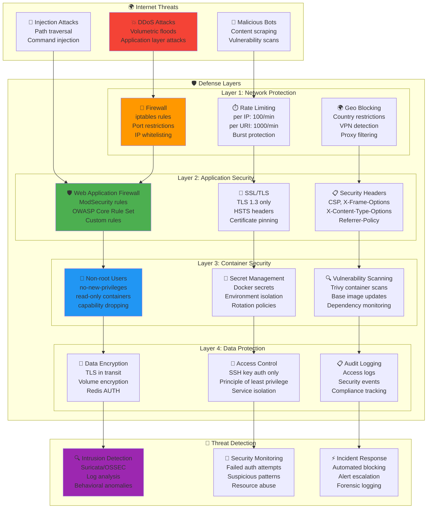
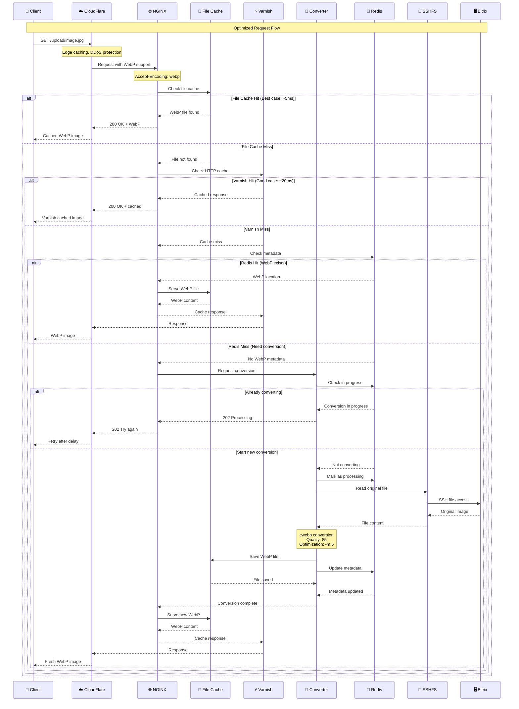
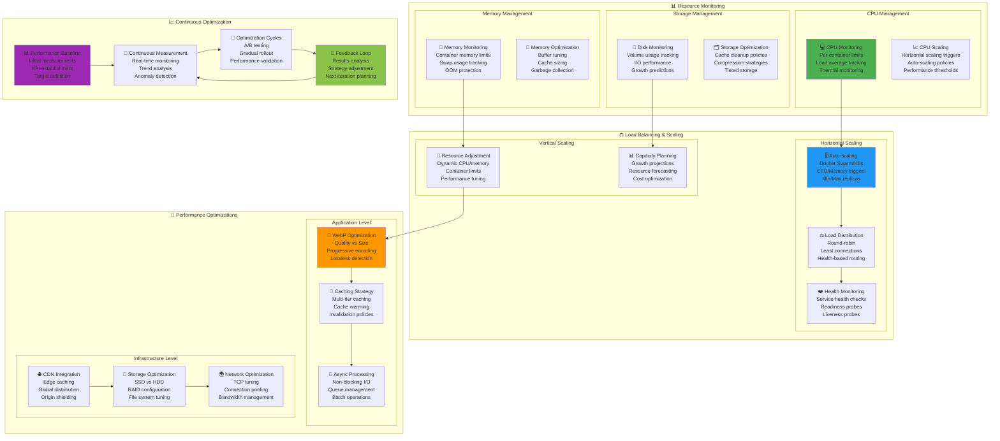
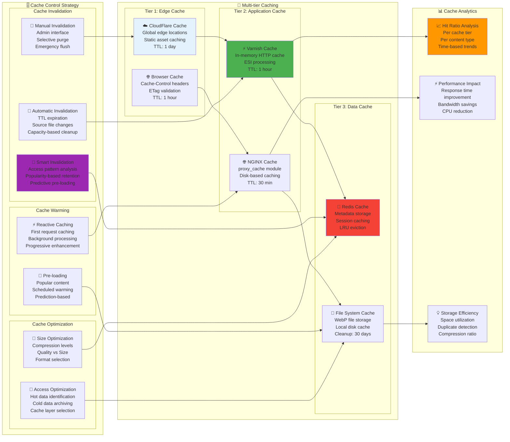

# 🔒 Безопасность и оптимизация Bitrix CDN

**Автор**: Chibilyaev Alexandr | **AAChibilyaev LTD** | info@aachibilyaev.com

## 🛡️ Security Architecture



## ⚡ Performance Optimization Strategy

```mermaid
flowchart TD
    subgraph "🎯 Optimization Targets"
        subgraph "Response Time Goals"
            T1[🚀 Static Files<br/>Target: < 50ms<br/>Current: ~20ms]
            T2[🎨 WebP Conversion<br/>Target: < 500ms<br/>Current: ~300ms]
            T3[💾 Cache Hits<br/>Target: < 10ms<br/>Current: ~5ms]
        end
        
        subgraph "Throughput Goals"
            T4[📊 Requests/sec<br/>Target: 1000 RPS<br/>Current: ~500 RPS]
            T5[🔄 Conversions/sec<br/>Target: 50/sec<br/>Current: ~30/sec]
            T6[💽 Cache Hit Ratio<br/>Target: > 85%<br/>Current: 82%]
        end
    end
    
    subgraph "🔧 Optimization Techniques"
        subgraph "NGINX Optimizations"
            N1[⚡ Worker Processes<br/>auto (= CPU cores)<br/>worker_connections: 2048<br/>keepalive_timeout: 65s]
            
            N2[📦 Gzip Compression<br/>gzip_comp_level: 6<br/>gzip_types: text/*<br/>gzip_vary: on]
            
            N3[💾 File Caching<br/>open_file_cache<br/>sendfile on<br/>tcp_nopush on]
            
            N4[🎯 Location Optimization<br/>try_files efficiency<br/>Map module usage<br/>Regex optimization]
        end
        
        subgraph "WebP Converter Optimizations"
            W1[🔧 Process Pool<br/>multiprocessing<br/>Worker threads: 4<br/>Queue management]
            
            W2[💾 Memory Management<br/>Memory limits<br/>Garbage collection<br/>Resource monitoring]
            
            W3[📁 File System<br/>tmpfs for temp files<br/>Async I/O<br/>Batch processing]
            
            W4[🎨 Conversion Settings<br/>Quality optimization<br/>Progressive encoding<br/>Format detection]
        end
        
        subgraph "Caching Strategy"
            C1[🌐 NGINX Cache<br/>proxy_cache_valid<br/>Cache-Control headers<br/>ETag handling]
            
            C2[⚡ Redis Cache<br/>LRU eviction<br/>TTL management<br/>Pipeline operations]
            
            C3[💽 Disk Cache<br/>WebP file cache<br/>Cleanup policies<br/>Size monitoring]
        end
        
        subgraph "System Optimizations"
            S1[💻 CPU Affinity<br/>Container CPU sets<br/>Process pinning<br/>NUMA awareness]
            
            S2[💾 Memory Tuning<br/>Swap configuration<br/>Page cache tuning<br/>OOM protection]
            
            S3[💽 Disk I/O<br/>I/O scheduler<br/>Mount options<br/>File system tuning]
            
            S4[🌐 Network Tuning<br/>TCP buffer sizes<br/>Connection pooling<br/>Kernel parameters]
        end
    end
    
    subgraph "📊 Performance Monitoring"
        METRICS[📈 Performance Metrics<br/>Response time percentiles<br/>Throughput measurements<br/>Resource utilization]
        
        PROFILING[🔍 Application Profiling<br/>Python profiler<br/>Memory profiling<br/>CPU flame graphs]
        
        BENCHMARKS[🏁 Benchmark Tests<br/>Load testing<br/>Stress testing<br/>Capacity planning]
    end
    
    %% Flow relationships
    T1 --> N3
    T2 --> W1
    T3 --> C2
    T4 --> N1
    T5 --> W2
    T6 --> C1
    
    N1 --> N2
    N2 --> N3
    N3 --> N4
    
    W1 --> W2
    W2 --> W3
    W3 --> W4
    
    C1 --> C2
    C2 --> C3
    
    S1 --> S2
    S2 --> S3
    S3 --> S4
    
    N4 --> METRICS
    W4 --> PROFILING
    C3 --> BENCHMARKS

    style T2 fill:#4caf50
    style W1 fill:#2196f3
    style C2 fill:#f44336
    style METRICS fill:#ff9800
    style S1 fill:#9c27b0
```

## 🔐 Container Security Hardening

```mermaid
graph TB
    subgraph "🐳 Container Security Model"
        subgraph "Base Image Security"
            BI1[🏔️ Alpine Linux<br/>Minimal attack surface<br/>Regular security updates<br/>Package verification]
            
            BI2[🔍 Image Scanning<br/>Trivy vulnerability scan<br/>Critical CVE blocking<br/>Dependency audit]
            
            BI3[📦 Multi-stage Builds<br/>Build-time dependencies<br/>Runtime minimization<br/>Layer optimization]
        end
        
        subgraph "Runtime Security"
            R1[👤 Non-root Execution<br/>USER directive<br/>uid/gid mapping<br/>Capability dropping]
            
            R2[📂 Read-only Containers<br/>read_only: true<br/>tmpfs for writable paths<br/>Volume minimization]
            
            R3[🚫 Privilege Restrictions<br/>no-new-privileges<br/>security-opt settings<br/>AppArmor/SELinux]
            
            R4[🔒 Secret Management<br/>Docker secrets<br/>Environment isolation<br/>Runtime injection]
        end
        
        subgraph "Network Security"
            N1[🌐 Network Isolation<br/>Custom bridge network<br/>Service-to-service only<br/>External access control]
            
            N2[🔥 Internal Firewall<br/>iptables rules<br/>Port restrictions<br/>Protocol filtering]
            
            N3[🔐 TLS Encryption<br/>Inter-service TLS<br/>Certificate management<br/>Mutual authentication]
        end
    end
    
    subgraph "🛡️ Security Compliance"
        subgraph "CIS Benchmarks"
            CIS1[📋 CIS Docker<br/>Container configuration<br/>Host hardening<br/>Image compliance]
            
            CIS2[📊 Compliance Monitoring<br/>Automated scanning<br/>Drift detection<br/>Remediation alerts]
        end
        
        subgraph "Security Policies"
            POL1[📝 Security Policies<br/>Pod Security Standards<br/>Network policies<br/>RBAC rules]
            
            POL2[🔍 Policy Enforcement<br/>Admission controllers<br/>OPA/Gatekeeper<br/>Continuous compliance]
        end
    end
    
    subgraph "🚨 Threat Detection & Response"
        DETECT[🔍 Runtime Detection<br/>Falco rules<br/>Anomaly detection<br/>Behavioral analysis]
        
        RESPOND[⚡ Automated Response<br/>Container isolation<br/>Traffic blocking<br/>Incident logging]
        
        FORENSICS[🔬 Forensic Analysis<br/>Container snapshots<br/>Log preservation<br/>Attack timeline]
    end
    
    %% Security flow
    BI1 --> BI2
    BI2 --> BI3
    BI3 --> R1
    
    R1 --> R2
    R2 --> R3
    R3 --> R4
    
    R4 --> N1
    N1 --> N2
    N2 --> N3
    
    N3 --> CIS1
    CIS1 --> CIS2
    CIS2 --> POL1
    POL1 --> POL2
    
    POL2 --> DETECT
    DETECT --> RESPOND
    RESPOND --> FORENSICS

    style BI2 fill:#ff9800
    style R1 fill:#4caf50
    style N1 fill:#2196f3
    style DETECT fill:#f44336
    style POL1 fill:#9c27b0
```



## ⚡ Performance Optimization Flow



## 🎚️ Resource Management & Scaling



## 🎯 Cache Optimization Strategy



## 🔧 System Tuning Parameters

```mermaid
graph TB
    subgraph "🖥️ Linux Kernel Tuning"
        subgraph "Network Stack"
            NET1[🌐 TCP Settings<br/>net.core.somaxconn = 65536<br/>net.ipv4.tcp_max_syn_backlog = 65536<br/>net.ipv4.tcp_fin_timeout = 30]
            
            NET2[📦 Buffer Sizes<br/>net.core.rmem_max = 16777216<br/>net.core.wmem_max = 16777216<br/>net.ipv4.tcp_rmem = 4096 65536 16777216]
            
            NET3[🔄 Connection Management<br/>net.ipv4.tcp_tw_reuse = 1<br/>net.ipv4.ip_local_port_range = 1024 65535<br/>net.netfilter.nf_conntrack_max = 262144]
        end
        
        subgraph "File System"
            FS1[📁 File Descriptors<br/>fs.file-max = 2097152<br/>nofile limit = 1048576<br/>fs.inotify.max_user_watches = 524288]
            
            FS2[💽 I/O Scheduler<br/>elevator=mq-deadline<br/>queue_depth optimization<br/>read-ahead tuning]
            
            FS3[💾 Virtual Memory<br/>vm.dirty_ratio = 15<br/>vm.dirty_background_ratio = 5<br/>vm.swappiness = 10]
        end
        
        subgraph "Security & Limits"
            SEC1[🔒 Process Limits<br/>kernel.pid_max = 4194304<br/>kernel.threads-max = 4194304<br/>max user processes = 32768]
            
            SEC2[🛡️ Security Settings<br/>kernel.dmesg_restrict = 1<br/>net.ipv4.conf.all.send_redirects = 0<br/>net.ipv4.conf.all.accept_redirects = 0]
        end
    end
    
    subgraph "🐳 Container Resource Limits"
        subgraph "Memory Limits"
            MEM_NGINX[🌐 NGINX: 2GB<br/>memory: 2048m<br/>memswap_limit: 2048m<br/>oom_kill_disable: false]
            
            MEM_CONVERTER[🎨 Converter: 2GB<br/>memory: 2048m<br/>Memory monitoring<br/>Graceful degradation]
            
            MEM_REDIS[🔴 Redis: 512MB<br/>maxmemory: 512mb<br/>maxmemory-policy: allkeys-lru<br/>Memory alerts]
        end
        
        subgraph "CPU Limits"
            CPU_NGINX[🌐 NGINX: 2 cores<br/>cpus: "2.0"<br/>Worker processes: auto<br/>CPU affinity]
            
            CPU_CONVERTER[🎨 Converter: 2 cores<br/>cpus: "2.0"<br/>Process pool: 4<br/>Nice priority: 10]
        end
        
        subgraph "I/O Limits"
            IO_LIMITS[💽 I/O Throttling<br/>blkio_weight: 500<br/>device_read_bps: 50MB/s<br/>device_write_bps: 25MB/s]
        end
    end
    
    subgraph "📈 Performance Monitoring"
        METRICS_COLLECT[📊 Metrics Collection<br/>System metrics<br/>Application metrics<br/>Custom metrics]
        
        PERFORMANCE_ANALYSIS[📈 Performance Analysis<br/>Bottleneck identification<br/>Trend analysis<br/>Capacity planning]
        
        OPTIMIZATION_LOOP[🔄 Optimization Loop<br/>Baseline establishment<br/>Incremental changes<br/>A/B testing]
    end
    
    %% Tuning relationships
    NET1 --> NET2
    NET2 --> NET3
    FS1 --> FS2
    FS2 --> FS3
    SEC1 --> SEC2
    
    MEM_NGINX --> CPU_NGINX
    MEM_CONVERTER --> CPU_CONVERTER
    MEM_REDIS --> IO_LIMITS
    
    %% Monitoring integration
    NET3 --> METRICS_COLLECT
    FS3 --> PERFORMANCE_ANALYSIS
    IO_LIMITS --> OPTIMIZATION_LOOP

    style NET1 fill:#4caf50
    style MEM_NGINX fill:#2196f3
    style METRICS_COLLECT fill:#ff9800
    style OPTIMIZATION_LOOP fill:#9c27b0
```