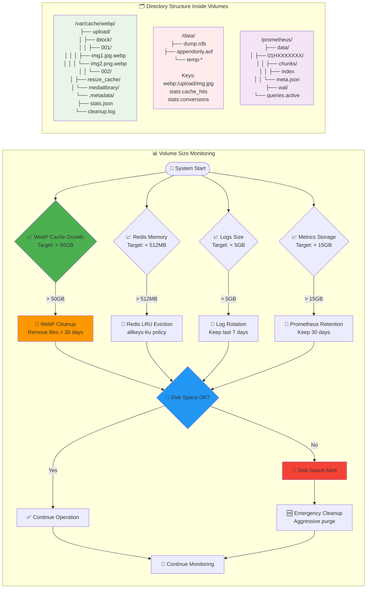

# 💾 Файловая система и Docker Volumes

**Автор**: Chibilyaev Alexandr | **AAChibilyaev LTD** | info@aachibilyaev.com

## 📂 Схема файловой системы

```mermaid
graph TB
    subgraph "🖥️ Bitrix Server (Server 1)"
        subgraph "File Storage"
            BITRIX_UPLOAD[📁 /var/www/bitrix/upload/<br/>🔸 product_images/<br/>🔸 iblock/<br/>🔸 resize_cache/<br/>🔸 medialibrary/]
        end
    end
    
    subgraph "⚡ CDN Server (Server 2) - Docker Host"
        subgraph "🐳 Docker Volumes"
            VOL_BITRIX[📦 bitrix-files<br/>Type: local<br/>Mount: /mnt/bitrix<br/>Mode: READ-ONLY]
            VOL_WEBP[📦 webp-cache<br/>Type: local<br/>Mount: /var/cache/webp<br/>Mode: READ-WRITE]
            VOL_REDIS[📦 redis-data<br/>Type: local<br/>Mount: /data<br/>Mode: READ-WRITE]
            VOL_PROMETHEUS[📦 prometheus-data<br/>Type: local<br/>Mount: /prometheus<br/>Mode: READ-WRITE]
            VOL_GRAFANA[📦 grafana-data<br/>Type: local<br/>Mount: /var/lib/grafana<br/>Mode: READ-WRITE]
        end
        
        subgraph "🔗 Host Bind Mounts"
            HOST_LOGS[📋 ./logs/<br/>📄 nginx/<br/>📄 converter/<br/>📄 sshfs/]
            HOST_CONFIGS[⚙️ ./docker/<br/>📄 nginx/conf.d/<br/>📄 prometheus/<br/>📄 grafana/]
            HOST_SSL[🔐 ./docker/ssl/<br/>📄 certificates/<br/>📄 private_keys/]
            HOST_SSH[🔑 ./docker/ssh/<br/>📄 bitrix_mount<br/>📄 bitrix_mount.pub]
        end
        
        subgraph "🐳 Container Mount Points"
            C_NGINX[🌐 nginx container<br/>/etc/nginx/ ← configs<br/>/var/log/nginx/ ← logs<br/>/mnt/bitrix/ ← bitrix-files<br/>/var/cache/webp/ ← webp-cache]
            
            C_CONVERTER[🎨 webp-converter<br/>/mnt/bitrix/ ← bitrix-files (ro)<br/>/var/cache/webp/ ← webp-cache<br/>/var/log/converter/ ← logs]
            
            C_SSHFS[📂 sshfs container<br/>/mnt/bitrix/ ← shared volume<br/>/root/.ssh/ ← ssh keys<br/>/var/log/sshfs/ ← logs]
            
            C_REDIS[🔴 redis container<br/>/data/ ← redis-data]
            
            C_PROMETHEUS[📊 prometheus<br/>/prometheus/ ← prometheus-data<br/>/etc/prometheus/ ← configs]
            
            C_GRAFANA[📈 grafana<br/>/var/lib/grafana/ ← grafana-data<br/>/etc/grafana/ ← configs]
        end
    end
    
    %% External connection
    BITRIX_UPLOAD -.->|SSH/SSHFS| VOL_BITRIX
    
    %% Volume mappings
    VOL_BITRIX --> C_NGINX
    VOL_BITRIX --> C_CONVERTER
    VOL_BITRIX --> C_SSHFS
    VOL_WEBP --> C_NGINX
    VOL_WEBP --> C_CONVERTER
    VOL_REDIS --> C_REDIS
    VOL_PROMETHEUS --> C_PROMETHEUS
    VOL_GRAFANA --> C_GRAFANA
    
    %% Host bind mappings
    HOST_LOGS --> C_NGINX
    HOST_LOGS --> C_CONVERTER
    HOST_LOGS --> C_SSHFS
    HOST_CONFIGS --> C_NGINX
    HOST_CONFIGS --> C_PROMETHEUS
    HOST_CONFIGS --> C_GRAFANA
    HOST_SSL --> C_NGINX
    HOST_SSH --> C_SSHFS

    style BITRIX_UPLOAD fill:#fff3e0
    style VOL_WEBP fill:#e8f5e8
    style VOL_BITRIX fill:#ffebee
    style C_NGINX fill:#4caf50
    style C_CONVERTER fill:#2196f3
    style HOST_LOGS fill:#f3e5f5
```

## 📈 Volume Growth & Cleanup Strategy



## 🔄 Volume Backup & Recovery

```mermaid
flowchart TD
    subgraph "💾 Backup Strategy"
        DAILY[📅 Daily Backup<br/>03:00 UTC]
        
        DAILY --> WEBP_BACKUP{🎨 WebP Cache<br/>Backup needed?}
        DAILY --> REDIS_BACKUP[🔴 Redis Dump<br/>redis-cli BGSAVE]
        DAILY --> CONFIG_BACKUP[⚙️ Config Backup<br/>tar -czf configs.tar.gz]
        DAILY --> PROMETHEUS_BACKUP[📊 Prometheus Backup<br/>Stop → Copy → Start]
        
        WEBP_BACKUP -->|Size < 10GB| FULL_WEBP[📦 Full WebP Backup]
        WEBP_BACKUP -->|Size > 10GB| SELECTIVE_WEBP[🎯 Selective Backup<br/>Recent files only]
        
        FULL_WEBP --> COMPRESS[🗜️ Compress & Store]
        SELECTIVE_WEBP --> COMPRESS
        REDIS_BACKUP --> COMPRESS
        CONFIG_BACKUP --> COMPRESS
        PROMETHEUS_BACKUP --> COMPRESS
        
        COMPRESS --> S3[☁️ Upload to S3/MinIO<br/>Optional]
        COMPRESS --> LOCAL[💽 Store Locally<br/>./backups/]
        
        S3 --> CLEANUP_OLD[🧹 Cleanup Old Backups<br/>Keep 30 days]
        LOCAL --> CLEANUP_OLD
    end
    
    subgraph "🔄 Recovery Process"
        DISASTER[💥 Disaster Scenario]
        
        DISASTER --> STOP_SERVICES[⛔ Stop All Containers]
        STOP_SERVICES --> RESTORE_VOLUMES[📦 Restore Volumes]
        
        RESTORE_VOLUMES --> RESTORE_CONFIGS[⚙️ Restore Configs]
        RESTORE_CONFIGS --> RESTORE_REDIS[🔴 Restore Redis Data]
        RESTORE_REDIS --> START_SERVICES[🚀 Start Services]
        
        START_SERVICES --> HEALTH_CHECK[❤️ Health Verification]
        HEALTH_CHECK -->|✅ OK| OPERATIONAL[✅ System Operational]
        HEALTH_CHECK -->|❌ Fail| ROLLBACK[🔄 Rollback to Previous]
        
        ROLLBACK --> RESTORE_VOLUMES
        OPERATIONAL --> MONITOR[👀 Continue Monitoring]
    end

    style DAILY fill:#4caf50
    style DISASTER fill:#f44336
    style COMPRESS fill:#ff9800
    style OPERATIONAL fill:#8bc34a
    style ROLLBACK fill:#ffeb3b
```

